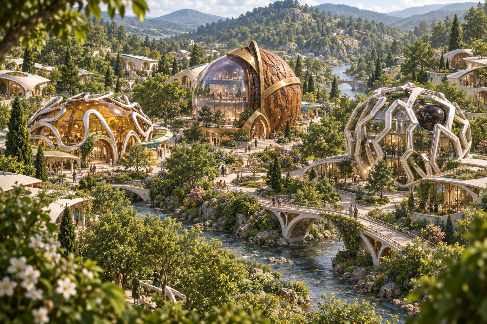

# Livistone

A welcoming art-and-science fantasy town inspired by Livia Lore and Livia Zaharia's jewelry: smooth white sculptural architecture, fresh green trees, a modest river, and sheltered places for everyday life.

## First concept

The three civic identities are confirmed by the user:

- **Nut of Power — City Hall**, joining walnut shell, crystal and brass.
- **Mitoring — Ministry of Energy**, with amber and folded silver-white contours.
- **Nanot — Ministry of Science**, with the pendant's irregular open lattice.

The first image explores a literal translation of the three artifacts into inhabited civic buildings. Smaller homes use smooth white shells and more subtle jewelry-inspired details. Trees, shaded walks, covered approaches and gardens make the town feel intimate.

The image is an artistic concept, not a settled masterplan or engineering design. The shared appearance and individual landmark identities can guide subsequent views; dimensions, topology and building performance still need design development.

## Concept package

- [Design brief](concepts/01-garden-town/brief.md)
- [Generation record and source references](concepts/01-garden-town/generation.json)
- [Town overview prompt](concepts/01-garden-town/prompts/01-town-overview.txt)
- [City Hall close-up prompt](concepts/01-garden-town/prompts/02-city-hall.txt)
- [Ministry of Energy close-up prompt](concepts/01-garden-town/prompts/03-ministry-of-energy.txt)
- [Ministry of Science close-up prompt](concepts/01-garden-town/prompts/04-ministry-of-science.txt)

## Generation status

The overview was generated with the built-in image generation tool and saved at `concepts/01-garden-town/images/01-town-overview.png` (1536 × 1024).

The City Hall image request was blocked by the tool's usage limit. The Energy and Science close-ups have prepared prompts but have not been submitted. No API fallback call has been made; no `OPENAI_API_KEY` was configured in the process environment or either workspace's `.env` when checked. Only the overview currently exists as a generated image.

## Next design decisions

Review the balance of literal jewelry forms and white architecture, the relative scale of the three civic landmarks, the amount of greenery, and the atmosphere at walking height. Livia's own home and workshop remain open for discussion.

The user approved the visual direction. The [browser game implementation plan](docs/3d-game-plan.md) selects TypeScript, Three.js, and Rapier WebAssembly physics. The first release will support exploration and lore, first-person walking plus a 3D aerial map, and desktop/mobile browsers from the start. Original STL and possibly Grasshopper files can be supplied later. The first implementation milestone is a walk from the river into City Hall, with touch controls and map switching. No web game has been implemented yet.
