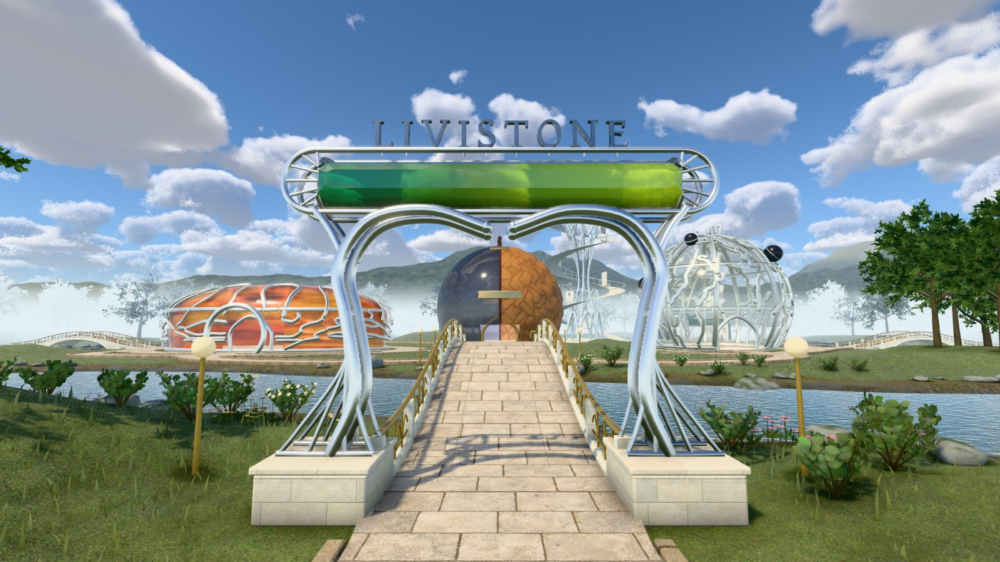
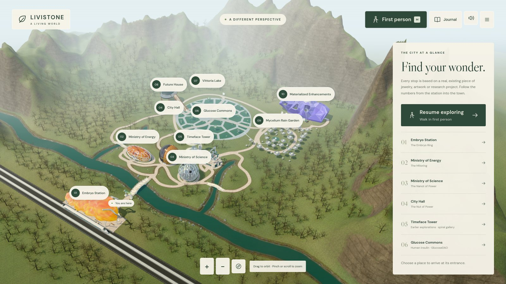

# Livistone

**Walk into a town where rings and pendants have become buildings.**



Livia Zaharia trained as an architect, became a parametric jewellery designer and then a citizen scientist. Livistone puts all three in one place: a 3D town in your browser where her jewellery has grown to the size of buildings you can walk into, and her research projects have places of their own.

You step off a train at a station roofed in amber, walk under a ring-shaped city gate and cross the river. Ahead of you is a City Hall made from a walnut shell and smoky crystal. Further on you'll find an amber Ministry of Energy wrapped in folded silver, a lake laced with silver walkways, a grove of silver mushrooms, a copper camel whose neck you can climb, and a violet crystal hill with a human figure on its summit.

**[▶ Visit Livistone](https://livistone.liviazaharia.com/)** (a recent browser is all you need) · [Run it locally](#run-it-locally) · [How it's made](#how-its-made) · [Technical guide](docs/technical-guide.md)

## Eleven stops, each from a real work or place


Every building and garden starts from something Livia actually made: a ring, a pendant, a research project. Inside, you'll find photographs of the original pieces and their stories.

| | Stop | Inspired by | What you'll find |
| --- | --- | --- | --- |
| 1 | **Embryo Station** | The Embryo Ring: raw amber held in silver prongs | You arrive here, under a canopy of deep honey amber that glows from within: a pierced silver ring entrance, a lamplit platform with benches, a clock and a departures board, and a parked maglev train you can board |
| 2 | **Ministry of Energy** | The Mitoring: amber in silver folds that recall the cristae inside mitochondria | A long amber hall, entered through the ring itself |
| 3 | **Ministry of Science** | The Nanot of Power pendant | A glass hall inside the pendant's silver lattice |
| 4 | **City Hall** | The Nut of Power: a walnut shell, amethyst and brass | The heart of the town, joined by brass clasps |
| 5 | **Timeface Tower** | Timeface and older studio works | A spiral gallery round a silver hourglass, with a terrace above the town |
| 6 | **Glucose Commons** | Livia's GlucoseDAO research | A walk beneath human insulin, traced from its atomic structure; six chapters of the research |
| 7 | **Vittoria Lake** | The Vittoria Amazonica pendant and the Dewdrop ring | Silver walkways between water pools and a faceted blue pavilion |
| 8 | **Future House** | Camel Dalí: copper, a 3D-printed part and leather | A copper camel drinking from the lake. Climb its neck into the exhibition cabin |
| 9 | **Mycelium Rain Garden** | The Mycelium ring, whose silver folds let water drain off its opal | Tall silver mushrooms with opal hearts and a visible rain rill |
| 10 | **Materialized Enhancements** | The [enhancement.bio](https://enhancement.bio/) bioart project | A violet Voronoi hill to climb, with gene-category crystals grown by the project itself |
| 11 | **Jepii Mici** | A real, steep trail in Romania's Bucegi Mountains, marked with a blue cross and closed in winter | A mountain trail beyond the lake: from a forest trailhead and its warning board, up a rocky gorge with a stream running out of a snow cave, past a gully of old snow and a 17 m waterfall off the plateau's lip, to a plateau of rhododendrons and its brook |

The facts, photographs and research come from Livia's work and link to their sources; the Jepii Mici trail is a real place, and everything Livistone builds round it is fiction. The powers the town gives its artifacts (the "Livia Lore") are fiction, and the game labels them that way.



*Press **M** at any time for the aerial map. The numbers follow the route from the station to the hill; choose a stop to arrive at its entrance.*

## How it's made

- **No 3D modelling program was involved.** Buildings, terrain, river, paths, bridges and planting are all generated in code each time the page loads. The binary assets are photographs, textures and two tree models.
- **The silver comes from the jewellery itself.** The ministries' silver strands were traced from Livia's own 3D models of the rings (1–2 million triangles each) and rebuilt as cast-silver ribbons around the halls.
- **The science is real data.** Glucose Commons lifts the backbone of human insulin from Protein Data Bank entry 1TRZ, and the crystals on the violet hill come out of the Materialized Enhancements pipeline.
- **The sky is physically based.** On load, the game bakes a single-scattering atmosphere with ray-marched clouds, or a night sky with stars, the Milky Way and the moon. Distant mountain ranges fade into the valley haze.
- **It's a static website.** It uses Three.js with WebGPU (falling back to WebGL 2) and Rapier physics in WebAssembly, and there's no server, account or database. Your progress stays in your browser.
- **The soundtrack is Livia playing kalimba**, recorded on her phone.

Want the details? The [technical guide](docs/technical-guide.md) covers the architecture, assets and project history, and [the design plan](docs/3d-game-plan.md) says where it's going.

## Visiting the town

You only need a recent browser with hardware acceleration. The town renders with WebGPU where the browser offers it and with WebGL 2 everywhere else. You don't need to install anything, create an account or log in.

1. While the town loads, a screen introduces Livia with her homepage portrait. On short screens, scroll to see the whole portrait. The town opens in **first person at the station exit, facing the Livistone gate**.
2. Walk towards the bridge and the city gate. Press **Map** (M) to see the town from above, or pick a named stop to go straight to its entrance.
3. Approach a display and press **E**, or tap its prompt, to read the story. Click a photograph to enlarge it. The pointer turns into a hand over anything you can click. The posters at Materialized Enhancements open [enhancement.bio](https://enhancement.bio/) in a new tab. Large dark signs in gold lattice frames introduce a place; cream boards show individual pieces.
4. Open **Journal** to read the stories and browse the jewellery catalogue at any time.

On the bridge approach, an introduction poster on the right tells how Livia went from architecture to parametric jewellery and citizen science. A photo poster on the left shows the King's Chapel Double Ring that inspired the gate. As you walk, a panel names whatever you're passing in one sentence; choose **Read story**, click the **E** control or press **E** to read more. The line icon folds the panel down to its labels and the square icon restores it. The desktop controls strip folds the same way.

| Action | Computer | Phone or tablet |
| --- | --- | --- |
| Walk | W/A/S/D or arrow keys; Shift moves faster | Left thumbstick |
| Look around | Hold the left mouse button and drag; ←/→ also turn | Drag the scene |
| Jump | Space | Jump button |
| Read a nearby display | E or click its prompt | Tap its prompt |
| Fold or expand the nearby description | Line / square icon on the place card | Line / square icon on the place card |
| Fold or expand control hints | Line / square icon on the hint strip | Touch controls stay visible |
| Toggle sound | Speaker button or menu | Speaker button or menu |
| Your time, day or night | T or the clock / sun / moon button | Clock / sun / moon button |
| Switch map / walking | M or the top-bar view button | The top-bar view button |
| Move / zoom the map | Drag / scroll | Drag / pinch |
| Menu | Escape or ☰ | ☰ |

Jump to clear gallery rails, wade across the river, and climb the copper ramp into Future House or the facets of the violet hill. Falls do no damage.

### Make yourself comfortable

- **Day or night:** the clock, sun and moon button in the top bar (or **T**) switches between your time, day and night; the menu offers the same choice. Your time follows your device's clock, day and night ignore it, and the choice is remembered on this device. A switch can take a moment, longest the first time, while the town prepares the new light; the button pulses until it is done.
- **Music:** on by default. If your browser blocks autoplay, it starts after your first click, tap or keypress. Use the speaker button or **Livistone Radio** in the menu whenever you prefer silence.
- **About the music:** these are informal phone recordings of Livia Zaharia playing kalimba, not professional studio recordings. The six included clips were reviewed and approved by Livia.
- **Performance:** select **Gentle** visual detail if movement is slow. Initial loading can take longer on a phone or a slower connection. The game picks one of three graphics profiles automatically (GPU, mobile/integrated graphics, or CPU software rendering) and shows it in the menu. Resolution then adapts to the frame rate: the GPU profile aims for 50 FPS and the mobile profile for 28. Software rendering on the CPU still runs at only 2–4 FPS, so it is not yet playable.
- **Progress:** visits and stories read are saved in this browser. They do not sync between devices; clearing site data resets them.
- **Lost?** Choose a destination on the map, or use the menu’s return-to-entrance action.


Production visits use Umami analytics and session replays, loaded only on `livistone.liviazaharia.com`. Localhost, LAN and preview hosts stay untracked; see [deployment details](docs/deployment.md#verify-a-release).

## Run it locally

This section is for running your own copy. Visitors to the published website can skip it. An IDE is optional; a terminal is enough.

Install **Git**, **Git LFS**, **Node.js 22.12 or newer**, and **Bun** (the project pins Bun 1.4.2). Installation guides: [Git LFS](https://git-lfs.com/), [Node.js](https://nodejs.org/en/download), [Bun](https://bun.com/docs/installation).

In PowerShell on Windows, Terminal on macOS, or a Linux shell:

```sh
git clone https://github.com/GlucoseDAO/livistone.git
cd livistone
git lfs install --local --skip-repo
git lfs pull
bun install --frozen-lockfile
bun run dev
```

Repository access is required if GitHub asks you to sign in. If you already have a checkout, use that folder instead of cloning again. The repository supplies its LFS push hook, so `--skip-repo` preserves it. Git LFS downloads the music files; ordinary Git pointer files cannot play audio.

Open **http://localhost:5173/** on the computer. The development server listens on `0.0.0.0` by default, so a phone on the same Wi-Fi can open **`http://<computer-LAN-IP>:5173/`**. On Linux, `hostname -I` shows candidate IP addresses; use the address for your Wi-Fi interface. On Windows use `ipconfig`, or on macOS use `ipconfig getifaddr en0`. Keep the terminal open; **Ctrl+C** stops the server. If the phone cannot connect, check that both devices are on the same network and that the computer's firewall allows TCP port 5173. If port 5173 is already in use, use the existing server or stop it before starting another.

## Build, check and publish

```sh
bun run build
bun run preview
```

The build checks TypeScript, verifies the approved audio assets, and creates **`dist/`**. Preview it locally at **http://localhost:4173/**. Publish the contents of `dist/` with a static website host or production web server.

**[Production deployment instructions](docs/deployment.md)** cover build settings, Git LFS, the custom domain, HTTPS, updates and troubleshooting. Vite development and preview servers are for development and local checks.

### “This host is not allowed”

`vite.config.ts` explicitly allows `livistone.liviazaharia.com` for development and preview. If your existing deployment shows that error, pull the latest commit and **restart or redeploy the running service**. Merely refreshing the browser does not update its server configuration. The production guide explains how to replace the Vite process with static hosting.

## For contributors

```sh
bun run test --maxWorkers=1 --testTimeout=20000
bun run test:browser
bun run check:hosts
```

Browser tests require Chrome and use the dev server on port 5173. On Linux they turn on headless WebGPU; `LIVISTONE_BACKEND=webgl bun run test:browser` runs the same tests on the WebGL 2 fallback. `check:hosts` requires a completed build and checks real development/preview HTTP responses for the configured hostname and an unapproved hostname.

- [Technical guide: architecture, assets, controls and project history](docs/technical-guide.md)
- [README screenshots and how to retake them](docs/images/README.md)
- [Design and implementation plan](docs/3d-game-plan.md)
- [Contributor instructions](AGENTS.md)
- [Artwork and research references](docs/extension-references.md)
- [Enhancement hill and human-mesh provenance](docs/enhancement-reference.md)
- [Kalimba credits and source records](public/audio/kalimba/README.md)

Livistone is a playable prototype. Performance varies by device, and physical-phone and Safari verification (including Safari's WebGPU) remain ongoing work. The [technical guide](docs/technical-guide.md#look-and-materials) describes how the ground, stone, water, grass and lighting are made. Artwork and recording credits, third-party asset licences and concept references are preserved in the [technical guide](docs/technical-guide.md#credits-and-licensing).
