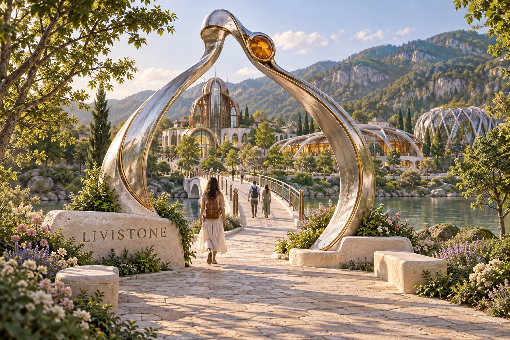
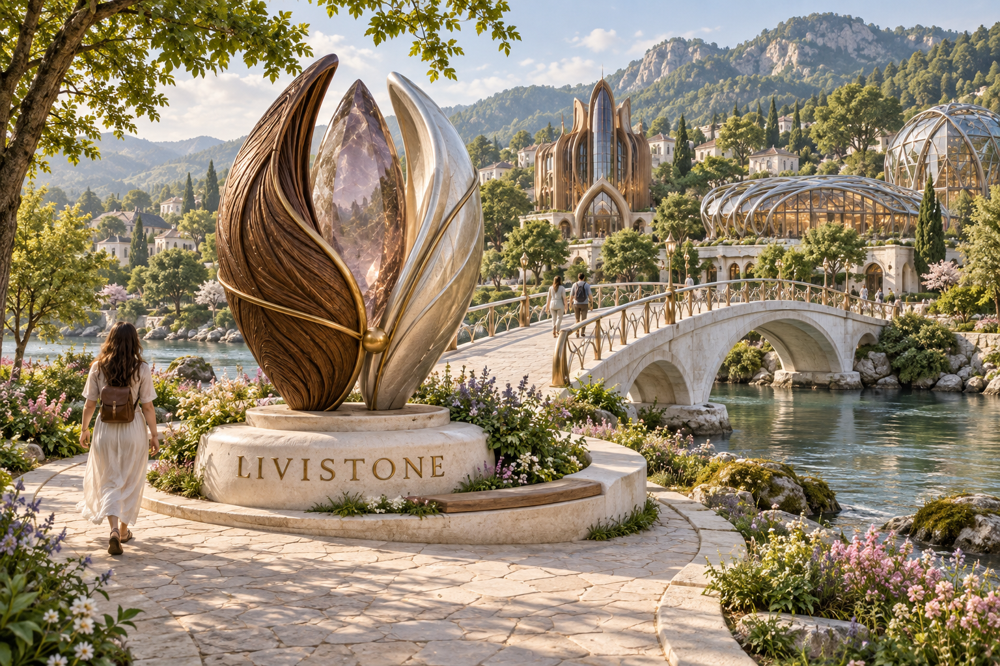
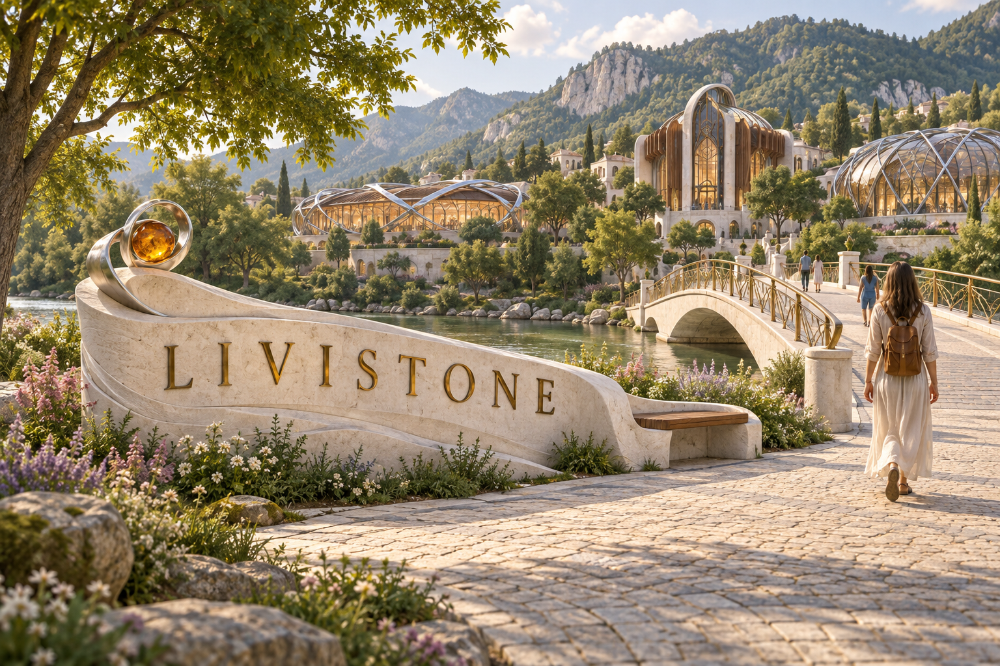
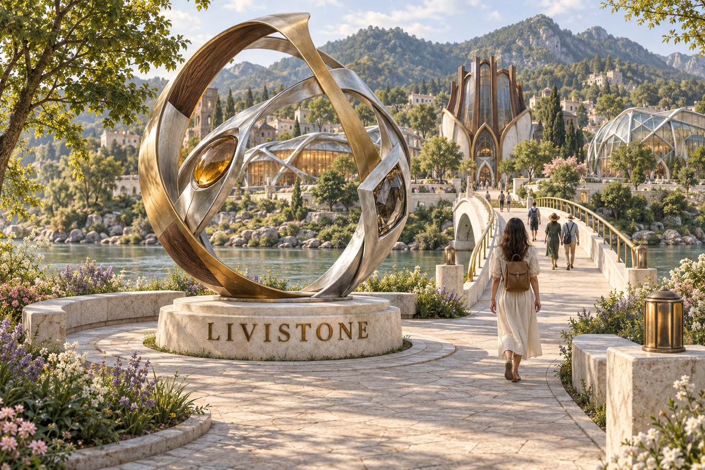
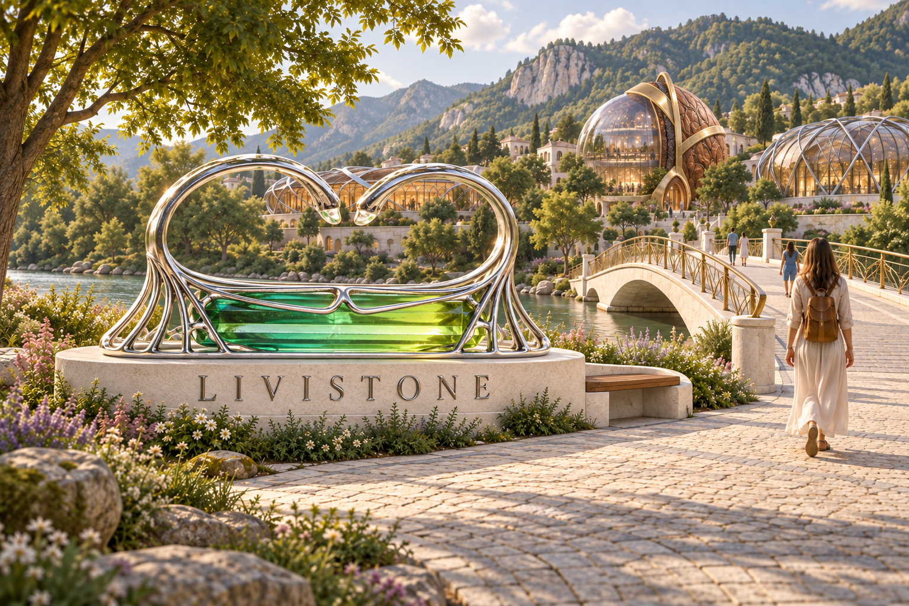
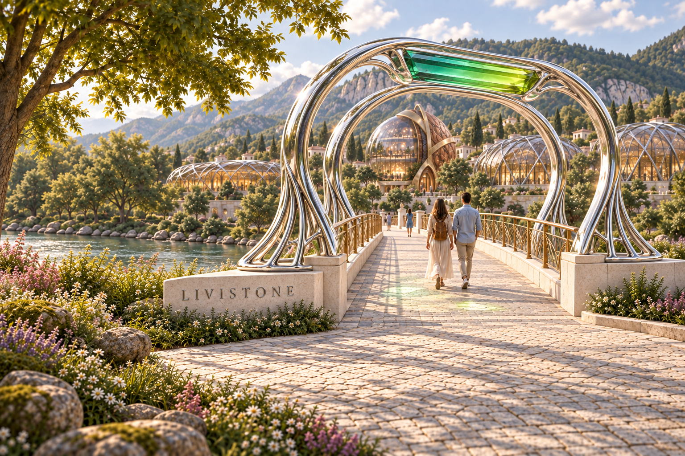
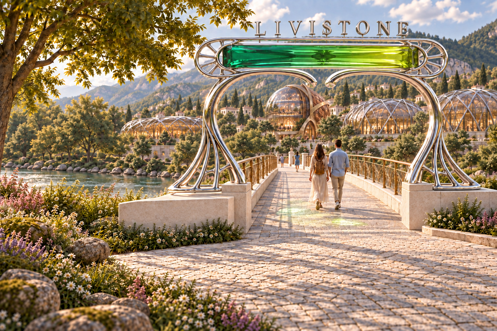

# Bridge arrival monument — concept alternatives

Date: 17 September 2026.

Five proposed city monuments for the arrival bank before the pedestrian bridge. These are alternatives for review, not approved additions or implemented game geometry. The town name uses the repository's established spelling, **Livistone**.

The designs follow the approved garden-town brief: warm-white sculptural stone, silver, brass, walnut textures, restrained amber and smoky crystal, lush planting, and a clear pedestrian approach. The town overview informed the written art direction; these are new generated scenes rather than edits of a gameplay screenshot.

| Alternative | Design intent |
| --- | --- |
| 01 — The Ribbon Gateway | An airy silver threshold framing the bridge. |
| 02 — The City Seed | A tactile walnut, silver, and crystal sculpture on a low plinth. |
| 03 — The Riverstone Welcome | A readable limestone city-name monument with integrated seating. |
| 04 — The Confluence | An open orb combining the three civic jewelry motifs. |
| 05 — King's Chapel Double Ring | Paired open silver loops and fan-vault ribs framing a long green prism, based directly on Livia's ring photographs. |

Generated with the built-in image generation tool. Exact submitted prompts are preserved in `prompts/`. Images are stored in `images/`; generation provenance is recorded in `generation.json`. Dimensions in the prompts express visual intent only. All five outputs have been visually inspected. The rendered landscapes are concept settings, not exact gameplay screenshots.

## King's Chapel source

The user requested an alternative based on **King's Chapel Double Ring** while the first four concepts were being generated. The local website catalogue at `../livia/content/pieces.md` (relative to the repository root) identifies the original piece as silver and enhanced tourmaline, 3 × 5 × 1.5 cm, 2022. Two studio photographs and the accompanying fan-vault comparison image from `../livia/assets/RJW2022/` were inspected and supplied directly to image generation. Their exact paths are recorded in `generation.json`.

Concept 05 preserves the paired open ring shanks, elongated green prism, rounded silver cradle, and fanned end ribs. Scaling the piece into a monument, using architectural glass, the plinth, and its lettering are new design proposals. The original jewelry and reference images are Livia Zaharia's; the monument scene is AI-generated. The approved town overview was also supplied to guide the background. This alternative was made by editing concept 03.

## Images and exact prompts

### The Ribbon Gateway

[Full image](images/01-ribbon-gateway.png) · [Exact prompt](prompts/01-ribbon-gateway.txt)

### The City Seed

[Full image](images/02-city-seed.png) · [Exact prompt](prompts/02-city-seed.txt)

### The Riverstone Welcome

[Full image](images/03-riverstone-welcome.png) · [Exact prompt](prompts/03-riverstone-welcome.txt)

### The Confluence

[Full image](images/04-confluence-orb.png) · [Exact prompt](prompts/04-confluence-orb.txt)

### King’s Chapel Double Ring

[Full image](images/05-kings-chapel-double-ring.png) · [Exact prompt](prompts/05-kings-chapel-double-ring.txt)

## 18 September 2026 — King's Chapel as a bridge arch

The user asked to adapt the two-finger ring into an arch over the bridge. Concept 06 transforms the paired loops into silver arch frames spanning the bridge entrance, carries the fan ribs down to side abutments, and raises the long green prism above the walking route. The previous freestanding monument is removed from this alternative. The earlier five studies remain preserved above.

[Full image](images/06-kings-chapel-bridge-arch.png) · [Exact prompt](prompts/06-kings-chapel-bridge-arch.txt) · [Generation record](generation-06.json)

Created with the built-in image generation tool, using concept 05 and the original ring photograph and fan-vault illustration as references. Visually reviewed: the bridge passes beneath the paired frames, the stone is overhead, and the city name is readable. The rendering places the green prism as a broad crown; the prompt proposed a longitudinal roof ridge. This remains a concept image, not implemented geometry or an engineering design.

## 18 September 2026 — closer ring geometry and a longer stone

The user requested a closer resemblance to the original two-finger ring and a longer stone. Concept 07 replaces the rounded gateway silhouette with a long, nearly horizontal green prism inside a thin capsule bezel. The bezel has radial fan details at both rounded ends; two opposed silver curves finish in separated inward-facing tips above the passage. Side ribs connect to the existing bridge abutments. The original ring photographs guided this edit directly.

[Full image](images/07-kings-chapel-long-stone-arch.png) · [Exact prompt](prompts/07-kings-chapel-long-stone-arch.txt) · [Generation record](generation-07.json)

Generated with the built-in image generation tool and visually inspected. The green stone is visibly longer, the open tips and rounded fan-spoked bezel ends recall the source ring, and the central bridge passage remains clear. This is an architectural interpretation for review; no game geometry has been changed.

## 18 September 2026 — city name above the ring

At the user's request, concept 08 moves **LIVISTONE** from the left limestone abutment to raised silver capitals mounted above the long ring bezel. The previous base inscription is removed. The green prism and silver ring structure retain the design of concept 07.

[Full image](images/08-kings-chapel-name-on-top.png) · [Exact prompt](prompts/08-kings-chapel-name-on-top.txt) · [Generation record](generation-08.json)

Created with the built-in image generation tool. Visually inspected for correct lettering, placement above the ring, removal of the old inscription, and preservation of the arch. Earlier concepts are preserved; this remains an image proposal.

### User approval — lettering placement

On 18 September 2026, the user approved the city name above the ring: “yes, the livinstone on top looks good”. Keep the raised **LIVISTONE** lettering above the bezel as shown in concept 08. This records approval of the lettering placement; implementation has not been requested in this exchange.
