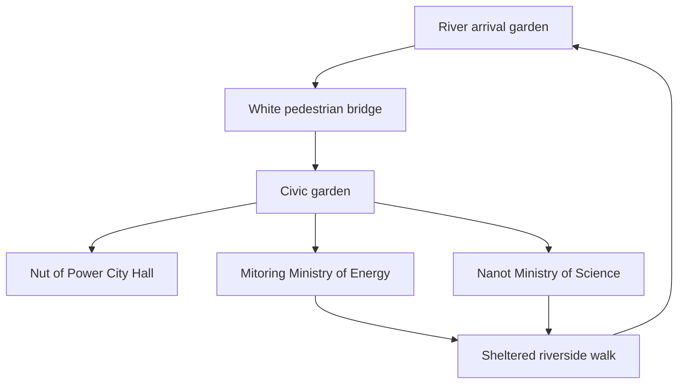
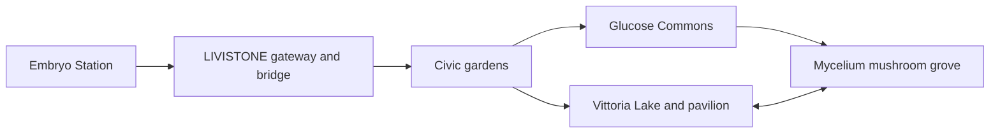

# Livistone: browser game implementation plan

Status: procedural implementation updated 19 September 2026, following the 16 September design interview. The playable prototype includes all three civic ground floors, Embryo Station and its boardable train, Glucose Commons, the integrated Living Waters town gardens, town bridges and river gardens, local progress, first-person walking and an aerial map. Reduced town meshes are selected before load from a coarse pointer, software GL, or a typical laptop iGPU; walking uses nearer fog, a short camera far plane, and cell LOD. Discrete GPUs stay on the rich mesh path. Physical frame times on those machines remain unmeasured. Loading opens the aerial view with a prominent **Start exploring** button. Clicking a landmark label or map list entry places the visitor outside its entrance, facing inward, in first person. Every landmark shares one scene, terrain and physics world. Living Waters is directly walkable from the civic gardens. Embryo Station sits on the southern arrival bank, facing the bridge; wooded foothills rise into uneven mountain ridges. The view switch preserves position; the persistent **First person / Top view** button (M), journal and menu remain available across browsing panels. Mouse look requires a held left button; desktop and simultaneous touch movement/look are supported.

The curated gallery expansion replaces the rotating cylinders with **32 permanent planar posters** across four collections and a **35-work searchable, filterable journal catalogue**. Facts and 70 photographs come from the adjacent Livia archive, with local thumbnail/full-size derivatives, provenance and attribution. Full images load on demand. The insulin pavilion adds six research posters sourced from GlucoseDAO’s public repositories and scientific molecular records. The Living Waters prototype adds Vittoria’s irregular water eyes and silver routes, the Dewdrop-inspired aquamarine pavilion, Mycelium silver mushroom crowns around opal hearts and drainage, and three source-linked garden stories.

Existing architectural work is preserved: STL-derived Mitoring/Nanot silver, walnut City Hall, the deep pierced Embryo ring and thick amber, two real mountain railway bores, the King’s Chapel entrance gateway, three masonry bridges, tributaries and a walk-through silver hourglass tower. Placeholder dome homes remain removed. Original STLs stay offline; their extracted JSON strands are preserved, and their historical extractor is still missing. The earlier design and implementation history is retained in [concepts/](../concepts/), including [the station](../concepts/06-town-extension/notes.md), [railway](../concepts/08-mountain-railway/notes.md), [river gardens](../concepts/09-river-gardens/notes.md), [rail excursion](../concepts/10-rail-gardens/notes.md), [glucose pavilion](../concepts/11-glucose-pavilion/notes.md) and [curated galleries](../concepts/12-curated-galleries/notes.md).

This is a playable procedural implementation, not a completed production release. Multi-room civic interiors, authored housing/GLB replacements, optional hands-on ministry exhibits, comprehensive resource disposal/context-loss recovery, and measured physical-phone/Safari performance remain open. Sunfinder and the Eye of Winter double moon gate remain design proposals. The milestone table describes acceptance gates; automation and desktop touch emulation do not establish physical-device performance or release readiness.

## 1. Product direction

Build a small, beautiful, explorable town that opens from a normal web link on desktop or mobile. Players arrive beside the river, walk through green streets, cross bridges, and physically enter the three jewelry-inspired civic buildings. Interiors have real floors, rooms, windows, doors, and views back into the town. A 3D aerial map lets players inspect the settlement and orient themselves without losing their walking position.

The approved [town overview](../concepts/01-garden-town/images/01-town-overview.png) and [design brief](../concepts/01-garden-town/brief.md) establish the art direction: welcoming art-and-science fantasy, smooth white sculptural architecture, fresh greenery, intimate sheltered spaces, and the distinctive jewelry forms. The image guides appearance; we must design a consistent three-dimensional layout and floor plans from it.

Confirmed landmarks:

| Building | Identity to preserve | Proposed explorable spaces |
| --- | --- | --- |
| Nut of Power — City Hall | Joined walnut and smoky crystal halves, broad brass connections, dominant civic position | Sheltered entrance, public atrium, council room, garden-facing balcony |
| Mitoring — Ministry of Energy | Warm amber enclosed by irregular folded silver-white ribs | Public energy hall, a small interactive energy exhibit, enclosed winter garden |
| Nanot — Ministry of Science | Rounded volume with angular, nonuniform silver-white lattice and restrained dark inclusions | Public science gallery, an accessible demonstration laboratory, planted reading court |
| Embryo Ring — Railway Station | Deep openwork silver band entrance, glazed foyer, and thick raw amber body clasped by asymmetrical silver prongs | Glazed entrance foyer, open concourse, waiting benches, platform, boardable parked ultra-fast train |

Interior functions beyond the ministry assignments are design proposals. We will preserve the distinction between source lore and new game fiction.

### Glucose Commons: molecular architecture and open research

The user requested one additional place for Livia’s glucose-prediction work. This building uses scientific molecular data rather than assigning a new civic role to another jewelry piece. It sits at `(38, -40)`, between Science and the eastern approach to Embryo Station.

- Preserve the deposited fold through a uniform scale, axis rotation and translation; never hand-draw the insulin chains or call insulin “glucose.” Select and label the A/B unit from 1TRZ rather than implying a full hexamer. The smaller GLC graph is an ideal alpha-D-glucopyranose model, with hydrogens omitted.
- Keep the insulin ribbons overhead, with two open entrances and a level north–south passage. Match floors, poster stands, columns and solid molecular geometry with colliders. Keep full plant canopies clear of the footprint and approaches.
- Use six independent, source-linked planar research posters: Livia and GlucoseDAO; Sugar-Sugar; cgm_format and data processing; GluMind/SugarOne and model evaluation; gluRPC; molecular provenance. Accessible dialogs expose ordinary repository/source links and remain readable on phones.
- Present achievements as verified public tools and research work. Do not invent clinical efficacy, benchmark winners or study outcomes. The town has no prediction backend and does not need participant glucose data.
- Bundle scientific coordinates and poster text locally; external links are optional visitor actions. Source review date, attribution, extraction script and checksums are recorded in `data/molecules/README.md` and the concept record.
- Preserve the existing version-1 save shape. Research discoveries and the new landmark are additional recognized IDs; old progress stays valid. The pavilion stays separate from `CIVIC_LANDMARKS` and jewelry-photo exhibition lookups.

Acceptance checks cover two-way walking, all poster approaches, desktop/touch source dialogs, correct molecule labels, save reload, unchanged position/yaw after map mode, and mobile horizontal overflow. Physical-device and Safari/iOS performance remain unverified.

### Collection hierarchy and interior photo galleries

Do not translate every piece of Livia's jewelry into a building. The adjacent Livia catalogue currently lists a larger archive of works in [`content/pieces.md`](../../livia/content/pieces.md), while only a minority have a silhouette, inhabitable void, distinct civic use, and sufficient source geometry or multi-angle photography to justify architectural enlargement. A town made from dozens of equally prominent jewelry buildings would weaken the legibility of the four established landmarks and turn the landscape into an object showroom.

Use four levels of representation:

| Level | Treatment | Scope |
| --- | --- | --- |
| Primary architecture | Fully inhabitable translation with a real town or transport function | Keep Nut of Power, Mitoring, Nanot, and Embryo; add no more than one or two future buildings after concept and walk-through review |
| Landscape landmark | Gate, tower, pavilion, garden, bridge, portal, or sculpture | King's Chapel gateway, Dark Nut portals, Timeface tower, Eye of Winter gate, Vittoria Lake, Mycelium Rain Garden, and similarly strong site-scale adaptations |
| Physical photo exhibition | Flat, freestanding poster panels placed inside existing buildings | Approximately 25–35 well-documented works at first, divided into building-specific themes |
| Journal catalogue | Searchable flat-photo and factual archive | Eventually all verified pieces, including older works that do not receive a physical poster in the current exhibition |

The **Sunfinder** remains the strongest candidate for one additional inhabitable building: its transparent enclosure, lens, directional purpose, and crown-like cage could become a small observatory or house of light near the mountain/science district. This is a candidate, not an approved implementation. Vittoria and Mycelium are approved as landscapes rather than additional buildings. Pieces such as Rotary Magnetic Fields, La Navette, Inline, Ice, Splash, Mountain of Gold, Blooming Pins, and Ceartari may become small installations or interactions without receiving interiors.

Replace the “same selectable catalogue in every hall” model with collections that belong to particular places. A visitor should have a reason to travel between buildings. Keep the architectural source piece as the permanent anchor in each location, then arrange the supporting posters as follows:

| Location | Curatorial identity | Priority pieces and collections |
| --- | --- | --- |
| **City Hall** | Materials, memory, identity, and the practice archive | Nut of Power and Dark Nut; *Beloved Food*: Bubinga Heart, Nucalong, Ammonite/Amonite, Nest, Nocciola; wood, walnut, stone, brass, and personal/custom works; a concise chronology from architecture and computation to jewelry |
| **Ministry of Energy** | Amber, light, heat, ice, and transformation | Mitoring; Amberbow; Amberear; Rotary Magnetic Fields; Berrynova; Ice; Splash; Eye of Winter photographs; selected cosmic/light pieces such as Sound of Stars, White Dwarf, and Supernova |
| **Ministry of Science** | Parametric nature, biology, morphology, and mechanisms | Nanot; the 2021 *Parametric (by) Nature* group—Ceartari, Beanut, Ice, Splash, Mountain of Gold, Mycelium; Vittoria Amazonica, Hessonite, Ludisia, Toxic; Brain, Funghi, Roots, Greentooth, and Peas in Pod; adaptive/mechanical pieces such as Cabochon, Bracelet Extension, and La Navette |
| **Embryo Station concourse** | Paths, memories, guides, and travel | A restrained transport-poster display for the 2022 group: La Navette, Piguen, Sticks and Stones, Sunfinder, Amberear, Inline, and King's Chapel. Keep this to approximately five to seven panels so the station remains a station, not a fourth civic museum |

The prototype resolves the overlapping priority lists into unique physical assignments: Ice, Splash and Amberear belong to Energy; La Navette belongs to the station. City Hall has eight panels, Energy eight, Science nine and the station seven. Eyelense, Timeface and Deep Sea Pearl are additional journal-only works. The full assignment and provenance are in `data/catalogue/selection.json` and `src/game/jewelry-catalogue.json`. Cross-references in the journal connect themes without duplicating physical posters.

The implemented poster system replaces the rotating photo cylinders; do not reintroduce pedestal tables or lore lecterns. Use quiet freestanding planar panels in shallow side bays and along interior perimeters, leaving central axes, windows, doors, gallery controls, and building-specific spatial features unobstructed. Initial capacity targets are eight to ten panels in City Hall, six to eight in Energy, eight to ten in Science, and five to seven in the station. Do not attempt to display all catalogue items simultaneously.

Each physical panel contains:

- one large uncropped photograph and, when useful, one smaller alternate/detail view;
- the verified title, collection, year, type, materials, and dimensions;
- a short artist-sourced description, clearly separated from Livistone fiction;
- an indication when the surrounding building or landscape is an interpretation of the piece; and
- a keyboard-, mouse-, and touch-accessible action that opens the existing flat aspect-preserving viewer for zoom, pan, next/previous, fit, and close.

Use approximately 60–90 words of body text at most. Panels must be readable at a comfortable first-person distance without requiring the player to collide with them. They need simple shared collision or stand-clearance volumes only where necessary; do not make every trim detail physical. On mobile, retain text legibility and the full photo viewer while reducing panel frame geometry, shadows, and the number of simultaneously loaded full-resolution images.

Content production begins with the approximately 35 works that already have structured type/material/dimension/year data in [`pieces.md`](../../livia/content/pieces.md) and the collection files under [`content/art-design/`](../../livia/content/art-design/). Older entries that have photographs but incomplete captions remain “studio archive” items until their facts are curated. Normalize title aliases such as Amonite/Ammonite in presentation data without renaming or deleting source files. Never invent missing materials, dates, exhibition history, or artist intent.

Bundle reviewed image derivatives locally; the runtime must not depend on the live Livia website. Keep original aspect ratios, attribution, source paths, and a build-time manifest that assigns stable IDs, physical exhibition location, collection tags, thumbnail/full-image files, and factual fields. Load thumbnails for the room first and full-resolution photographs only when a panel or viewer needs them. The journal can expose collection, year, material, type, and location filters after sufficient content exists.

## 2. Technology decision

Use **TypeScript, Vite, Three.js, and Rapier 3D physics compiled to WebAssembly**. Use Blender for authored meshes and glTF/GLB as the runtime asset format. Start with Three.js `WebGLRenderer` on WebGL 2.

This choice keeps the application in the browser's ordinary development ecosystem, makes custom architectural geometry straightforward, and uses WebAssembly for collision and physics work through Rapier. Rapier's JavaScript distribution is itself a WebAssembly module. [Rapier installation documentation](https://rapier.rs/docs/user_guides/javascript/getting_started_js/)

| Option | Assessment for Livistone | Decision |
| --- | --- | --- |
| TypeScript + Three.js + Rapier | Direct control over architecture, materials, web interface, asset loading, and the modest game systems this first release needs | Selected |
| TypeScript + Babylon.js | A strong alternative with integrated physics, character-controller, navigation, and game-oriented systems | Viable; the initial scope does not require adopting its broader engine conventions |
| Rust + Bevy compiled to WebAssembly | Viable if the project develops substantial simulation or prioritizes a Rust codebase | Adds a Rust/browser integration workflow without a demonstrated need for this primarily visual exploration game |

The comparison is a project judgment, not a claim that one engine universally performs better. Babylon's documented engine features include Havok physics and character control. Bevy publishes browser examples. [Babylon specifications](https://www.babylonjs.com/specifications/), [Bevy browser example results](https://example-runs.bevy.org/)

Start with the established WebGL 2 renderer so the initial project has one rendering path to validate. Three.js documents `WebGPURenderer` with a WebGL 2 fallback, but also notes material/postprocessing compatibility differences and remaining experimental behavior. Evaluate that renderer later against an actual Livistone scene; switching is a separate tested task. [Three.js renderer guidance](https://threejs.org/manual/en/webgpurenderer)

Writing the whole application in Rust would not by itself solve foliage overdraw, costly glass, large downloads, or poorly optimized meshes. Profile those costs before introducing a second application language.

Implementation stack:

- TypeScript with strict checking, Vite, and a committed package lockfile.
- Three.js for rendering and scene management; plain HTML/CSS for menus, readable lore panels, and settings.
- Rapier with a kinematic capsule for walking and separate simple collision geometry.
- Blender source assets exported to GLB; Meshopt geometry compression and KTX2 textures where the measured savings justify them.
- Small versioned JSON definitions for world zones, interactables, lore, and saved progress.
- Vitest for a few meaningful logic tests and Playwright for browser smoke checks, alongside manual graphics and movement review.
- Static HTTPS hosting for the proposed single-player release; no account or application server is necessary for that scope.

Choose and pin compatible package versions at implementation time. The renderer, asset decoders, and physics initialization must pass a small compatibility scene before detailed production.

## 3. Confirmed first-release scope

The confirmed scope is **exploration and lore, first-person walking plus a 3D aerial map, on desktop and mobile browsers from the beginning**. Single-player is the implementation choice for this exploration release.

The player can walk through the whole civic garden district and all three primary buildings, inspect the artifacts, and read the original place stories, curated jewelry captions and six research posters. The initial six-to-nine-story target has expanded without making reading mandatory. Exploration is welcoming and unhurried. A small optional route can connect the buildings, with one hands-on exhibit in each ministry. Doors to the principal buildings are available without completing a quest.

The original target of roughly 10–14 supporting homes or workshops remains future art production; the later approved garden revision removed the placeholder domes. Use a small modular kit when housing is developed. These establish the town and initially provide exterior streetscape; three complete landmark interiors take priority. More homes, Livia's personal workshop, residents, and additional districts can follow.

A short optional discovery sequence could be: inspect the artifact relationships in City Hall, adjust an amber energy exhibit at Mitoring, inspect a molecular model at Nanot, and record the discoveries in a journal. These are proposed game interactions, not literal demonstrations of medical efficacy.

Combat, multiplayer, city management, procedural infinite terrain, live AI characters, and a full seasonal simulation are separate expansions. A later multiplayer version would require a separate plan for authoritative session state, replication, reconnect behavior, identity, and hosting.

## 4. World layout and scale

Begin with an approximately **220 × 180 metre** playable district, bounded naturally by planted slopes and riverbanks. This is a blockout target, not a fixed measurement inferred from the illustration.

Place arrival on the near riverbank so the first player view recalls the approved overview. A modest bridge leads into a compact civic garden. City Hall occupies the main sightline, Energy sits to one side, and Science to the other. A loop through covered walks and river gardens connects all three.



This is a route diagram, not the final geographic map.

Use metres throughout. Block out a player eye height around 1.65–1.7 m and a comfortable walking speed around 3 m/s. Initial landmark dimensions can range from roughly 18–28 m across and 10–18 m high, adjusted after walking the scene. Avoid copying the illustration's proportions so literally that ordinary doors become enormous or stairs become unusable.

Draw floor plans and sections before detailing landmark shells. Every visible entrance needs an actual opening and valid circulation. Floors must fit inside the curved envelopes. Trees, overhangs, courtyards, and interior winter gardens should create visible shelter rather than merely decorate an exposed plaza.

<a id="approved-rail-excursion-vittoria-lake-and-mycelium-rain-garden"></a>

### Integrated town gardens: Vittoria Lake and Mycelium Rain Garden

#### Status, role, and route

The 18 September user correction supersedes the earlier remote-excursion placement. **Living Waters is part of the town**, centered at `(0, -110)`, immediately north of the civic gardens. Two footpaths join City Hall and Glucose Commons to the lake and Mycelium loop. The seven landmarks remain visible on one map and use one physics world. Preserve the earlier proposal as history in [the original concept record](../concepts/10-rail-gardens/notes.md), not as an instruction to restore a separate scene.

Embryo Station is rotated and placed on the southern bank, its ring exit at `(0, 60)` facing the Livistone gateway and bridge. Start exploring at `(0, 58)`, facing north. The station’s authored geometry, gallery, interactives and colliders receive the same rigid transform. A continuous terrain field joins the woodland to asymmetric ridges and river valleys; the playable bounds expand to x = −165…195 and z = −225…115 m, with the extended railway corridor still accessible.



The latest correction keeps **all rail facilities at the southern station**: one train, one passenger platform and two main guideways through the east and west mountain tunnels. There is no northern stop, garden train or loop. The train is a parked, boardable arrival interior. Walking connects every garden to town. The old excursion state machine has been removed; the diagnostic fields remain `zone: 'town'` and `journey: null` for compatibility.

Terrain uses overlapping elongated ridges with different heights and orientations, graded river valleys and wooded foothills. The rendered town ground and mountains share one elevation field, with a matching two-metre collision grid across the walking area. The railway sits at z = 79/85, with tunnel mouths at x = ±155 and far exits at x = ±370. Cut real apertures into the hillside and keep boarding floors and tunnel clearances aligned.

#### Authoritative jewelry references

The adjacent `livia` repository is the source archive. Its large photographs may be Git LFS pointer files in a checkout that has not pulled LFS objects, so each row also gives a live website fallback. Do not search for substitute imagery or redesign the pieces from their names alone.

| Source piece | Facts and image references | Features that must survive the landscape translation |
| --- | --- | --- |
| **Vittoria Amazonica pendant** | Silver and aquamarine, 4.5 × 4.5 × 1.0 cm, 2022; collection source: [`9_Survival (RJW 2023).md`](<../../livia/content/art-design/9_Survival (RJW 2023).md>); principal photographs: [`..._1.jpg`](<../../livia/assets/RJW2023/LiviaZaharia_pendant_VittoriaAmazonica_2022_silver_aquamarine_4.5x4.5x1.0cm_1.jpg>) and [`..._2.jpg`](<../../livia/assets/RJW2023/LiviaZaharia_pendant_VittoriaAmazonica_2022_silver_aquamarine_4.5x4.5x1.0cm_2.jpg>); [website fallback](https://livia.glucosedao.org/RJW2023/LiviaZaharia_pendant_VittoriaAmazonica_2022_silver_aquamarine_4.5x4.5x1.0cm_1.jpg) | A broad circular/lily-pad body, irregular branching silver veins, open cells between the veins, and a pale blue central stone. Preserve the asymmetrical biological network; do not simplify it into equal radial spokes or a generic circular plaza. |
| **Mycelium ring** | Sterling silver and opal, 2.1 × 2.0 × 2.8 cm, 2021; collection source: [`12_Parametric (by) nature (RJW 2021).md`](<../../livia/content/art-design/12_Parametric (by) nature (RJW 2021).md>); principal photographs: [`Mycelium...cm.jpg`](<../../livia/assets/RJW2021/LiviaZaharia_ring_Mycelium_2021_sterlingsilver_opal_2.1x2.0x2.8cm.jpg>) and [`...cm1.jpg`](<../../livia/assets/RJW2021/LiviaZaharia_ring_Mycelium_2021_sterlingsilver_opal_2.1x2.0x2.8cm1.jpg>); [website fallback](https://livia.glucosedao.org/RJW2021/LiviaZaharia_ring_Mycelium_2021_sterlingsilver_opal_2.1x2.0x2.8cm.jpg) | The opal is surrounded by a crown of repeated folded silver loops. Livia's source description explains that the setting was developed to let water drain away from porous opal, with mushrooms and fungi informing the solution. Preserve that relationship between folded mushroom crowns, water capture, and visible drainage. |
| **Dewdrop ring** | Adjustable cast-silver ring with treated Swiss blue topaz; catalogue entry: [`pieces.md`](../../livia/content/pieces.md); selected photographs: [`2313241738992752.jpg`](<../../livia/assets/pieces/Dewdrop ring/2313241738992752.jpg>) and [`2386235421693383.jpg`](<../../livia/assets/pieces/Dewdrop ring/2386235421693383.jpg>); [website fallback](https://livia.glucosedao.org/pieces/Dewdrop%20ring/2313241738992752.jpg) | A small faceted light-blue stone sits at the open end of a curling silver ring. Use its compact droplet silhouette, pointed facets, and open silver embrace to shape the pavilion. Dewdrop's stone is **topaz, not aquamarine**; the destination pavilion combines this silhouette with the aquamarine material identity already belonging to Vittoria. |

These references describe real jewelry. The lake, pavilion, garden ecology, and architecture are new Livistone fiction and must be labelled as interpretations rather than claims about the original objects.

#### Vittoria Lake: the pendant as walkable water geography

Enlarge Vittoria Amazonica into an approximately **80–110 m wide shallow lake landscape**. The pendant's silver network becomes a set of raised, walkable “nerve” bridges. The open areas between branches become many irregular water cells, visually related to terraced Japanese rice paddies: thin raised edges define neighboring pools at subtly different levels, reflections change from cell to cell, and the whole lake can be read as one cultivated living surface. This is a spatial and hydrological reference only; do not add generic Japanese gates, lanterns, buildings, or ornamental motifs.

The lake cells are **water eyes**. Each should have a distinct outline and a readable edge: pale wet stone or gravel at the rim, shallow luminous water, and a somewhat darker or more reflective center. Some eyes can contain reeds, aquatic leaves, submerged stones, or small ripples, but they must remain parts of one coherent Vittoria pattern. Avoid a regular grid, identical circles, or a single undivided pond. Use a shared lake/network field so water meshes, edge elevations, bridge supports, terrain, planting clearance, and collision agree.

The silver nerves are the primary walking routes. They must:

- follow the source pendant's irregular branching logic rather than equally spaced spokes;
- provide at least two choices around several water eyes, creating a small exploratory loop rather than one forced path;
- maintain roughly **1.8–2.4 m of clear walkable width**, with wider pauses at junctions;
- rise only enough to read above the water and remain comfortable for the capsule controller;
- use low organic lips, occasional widened edges, or restrained rails where a fall would otherwise be frustrating, without turning the lake into a conventional road bridge system;
- provide collision surfaces derived from the same curves and elevations as the rendered nerves; and
- include safe recovery points so stepping or falling into shallow water never traps the player.

The outer bank should feel like the broad margin of a lily pad, not a circular concrete quay. Use low planted berms, wet gravel, reeds, and a few woodland frames. Preserve long views from the civic approach across the branching network to the blue center. Trees must not conceal the overall pendant silhouette in aerial map mode.

#### Central Dewdrop aquamarine pavilion

At the convergence of the nerve bridges, the Vittoria aquamarine becomes a small inhabitable pavilion. Its massing takes the **faceted droplet** and open-ended silver embrace from the Dewdrop ring, but its blue mineral identity comes from Vittoria's documented aquamarine. Working size is approximately **10–14 m across and 8–12 m high**, subject to a walk-through blockout.

The pavilion should be a destination, not a jewel placed on a pedestal. At least two nerves must enter it at floor level. A translucent pale-aquamarine shell or cluster of facets encloses a quiet room, lookout, or water observatory; a curling silver structural band holds it without hiding the blue volume. Openings should frame the surrounding water eyes, and the interior floor must remain dry and level. Use restrained refraction near the player and a cheaper opaque/reflective blue material at distance and on mobile. Do not describe the pavilion as the literal Dewdrop jewel, and do not label Dewdrop's source stone as aquamarine.

Possible content is deliberately limited: one concise story panel can explain Vittoria, Dewdrop, the landscape transformation, and the distinction between the two stones. Do not fill the pavilion with a second large gallery or unrelated furniture. Its reward is the view back across the nerves and water eyes.

#### Mycelium Rain Garden: silver mushroom crowns and visible drainage

Place the Mycelium Rain Garden beside, but not inside, Vittoria Lake. The paths from the civic district divide clearly: one branch approaches the open lake; the other descends into a denser, sheltered rain garden. The gardens may exchange overflow water through a visible channel, but Mycelium keeps its own identity and must not become another lake cell.

Use the actual ring photographs: repeated curled silver folds surround an opal, with open gaps between them. Enlarge this into **mushroom sculptures with branching stems, open silver gills and opalescent centers**. Avoid literal fabric umbrellas, segmented green parasols and straight support spokes. The current crowns sit approximately 3.6–6.4 m above ground, with varied scale and rotation, and reserve their whole 2.7 m unit radius from the paths. Low reeds and the dry loop remain visible below them. Mobile uses fewer instances and fewer fold segments.

Water behavior is part of the design. Rain or collected mist should strike the mushroom crowns, run along visible ribs, drip from selected edges, and enter silver-lined rills leading to planted infiltration basins. Shallow pools can gather temporarily around an opalescent central wetland stone before draining toward the Vittoria system. The paths remain usable in all presentation states: rainfall is atmospheric and educational, never a gameplay hazard or a timed gate.

Raised porous-stone walks and short silver-edged crossings should provide an accessible loop through the garden, generally **1.8–2.4 m clear**. Keep canopies and dripping edges out of the capsule's head space. Reserve every plant's full canopy from paths, drainage rills, and sightlines. Render geometry and physics must share the same path elevations; decorative roots and fine drainage ribs should not create snagging collision.

The garden's interpretation panel should mention the real Mycelium design problem: the porous opal needed a setting that allowed water to drain, and fungi informed the solution. Do not turn that factual material story into a medical, ecological, or efficacy claim.

#### Shared implementation constraints

- Build the gardens into the town’s shared scene and Rapier world. Their ground comes from the same terrain mesh; never overlay a second terrain or hide the civic town when entering the gardens.
- Show every town and garden landmark together on the aerial map. Entering map mode must not move or turn the player.
- Keep one coherent set of world-space curves/fields for Vittoria nerves, water-eye boundaries, Mycelium drainage, paths, terrain, planting clearance, and colliders. Do not hand-align independent render and physics versions.
- Water eyes may share one animated material and atlas/mask data. Do not create a reflection camera, render target, or expensive transparent stack for every cell.
- Instance Mycelium plants by size/material family and spatial cell. Mobile reduces mushroom count, rib segments, water-edge geometry, refraction, and distant shadows while preserving the overall crown silhouette and a continuous walking route.
- The garden destination needs its own ambience, but audio begins only after user interaction and respects the existing mute/volume controls.
- Station train doors, boarding apertures, platform edges, garden paths, nerves and pavilion entries must all have matching simple colliders and headless traversal tests.
- Preserve `window.__livistone.snapshot()` and the existing save version when changing layout. The train remains parked at the southern station.

#### Acceptance criteria and remaining release gate

1. The player can walk directly from the civic district into Living Waters, and enter the southern Embryo Station and its parked train through both boarding bays on desktop and touch controls. All railway infrastructure belongs to that station.
2. The player can traverse multiple Vittoria nerve routes, reach and enter the central pavilion, fall or step into permitted shallow water without becoming trapped, and return to the civic gardens.
3. An aerial view clearly reads as the Vittoria pendant: one broad organic disc, irregular branching nerves, many water eyes, and a blue center—not a wheel, regular paddy grid, or generic lake.
4. The Mycelium garden reads as a family of curled silver mushroom crowns around opal hearts, visibly gathers and drains water, provides a complete dry walking loop, and preserves the real opal-drainage story.
5. The central pavilion reads as Vittoria's aquamarine interpreted through Dewdrop's silhouette; labels correctly identify Vittoria's aquamarine and Dewdrop's treated Swiss blue topaz.
6. Progress survives a reload at the supported station exit, and map mode returns the player to the exact prior position/orientation.
7. Desktop and mobile quality tiers preserve the same routes and landmark identities. Physical-phone and Safari/iOS performance must be measured before claiming the expansion is release-ready.

## 5. Turning jewelry and concept art into 3D assets

No model files were found in the two repositories during the initial inventory, so the blockout started from photographs and the concept. Two STL files have since been supplied and sit in `data/models/` (`+3mito.stl`, the Mitoring, ~985k triangles; `bila.stl`, the Nanot, ~2.2M triangles). Their measurements and structure are recorded in [concepts/02-jewelry-models/notes.md](../concepts/02-jewelry-models/notes.md). The solids stay offline; only their extracted strands (`src/world/strands/`) ship, and the halls, floors, doors, and colliders are built around them in code.

Original jewelry models will improve silhouette fidelity, but they still need architectural adaptation: interior space, wall thickness, doors, floors, circulation, and optimized topology. A solid printable pendant cannot simply be enlarged into a finished building.

When files arrive, preserve them unchanged under an asset-source folder and record units, piece identity, and dependencies. STL is a triangulated source: verify scale, normals, density, and mesh defects; create optimized architectural surfaces and material/UV assignments. For Grasshopper, obtain referenced Rhino geometry and plugin requirements alongside the definition, or request a baked geometry export if its dependencies are unavailable. Neither Rhino nor Grasshopper should be required by the browser runtime. Convert usable assets offline to GLB and keep the blockout's doorway, floor, and interaction anchors stable when replacing it. [Three.js STL loader](https://threejs.org/docs/pages/STLLoader.html)

Use a hybrid production approach:

1. **Blockout:** parametric primitives and curves for terrain, paths, floor plates, shells, and recognizable landmark silhouettes.
2. **One finished sample:** author City Hall and its arrival garden with final materials and a real interior. Validate the export and lighting workflow in the browser.
3. **Landmark production:** create controlled curved surfaces and swept structural ribbons in Blender; keep editable source models and repeatable export settings.
4. **Town kit:** reuse several white shell houses, canopy segments, windows, railings, bridge parts, benches, and planters with controlled variations.
5. **Landscape:** use a small, coherent family of licensed tree and plant assets with multiple levels of detail. Track source and license information for all external assets.

Nut shell relief belongs mainly in surface textures and normal maps. Mitoring's irregular loops and Nanot's folded angular lattice must remain real silhouette geometry. Keep their distinctive patterns instead of replacing both with generic ribbed spheres.

Each landmark deliverable includes an editable source model, optimized exterior, independently loadable interior, collision meshes, doorway anchors, interaction anchors, simplified distant appearance, textures, and a manifest entry. Use a shared origin and transforms so exterior and interior meet exactly.

Asset metadata identifies nodes such as `door_city_hall_main`, `spawn_city_hall_entry`, and `interact_artifact_constellation`. Gameplay looks up stable IDs rather than guessing from mesh order.

GLTFLoader supports glTF and relevant compression/material extensions, with explicit decoder setup for compressed assets. Self-host the required decoder files and handle texture/mesh disposal when unloading zones. [Three.js GLTFLoader](https://threejs.org/docs/pages/GLTFLoader.html)

## 6. Walking, entering buildings, and interactions

Use a capsule character with collision-aware movement, gravity, slope limits, stair handling, and recovery to a safe location if the player falls outside the playable area. Held-mouse dragging and Left/Right arrows handle looking; the physics controller determines movement. Moving the camera directly is insufficient for walking through an inhabited world.

Rapier provides movement correction, sliding, autostep, and ground snapping; these need tuning against Livistone's actual stairs and paths. Keep gravity and fixed-step integration explicit. [Rapier character controller](https://rapier.rs/docs/user_guides/javascript/character_controller/)

Desktop controls use held-left-button drag-to-look, A/D strafing, W/S or Up/Down movement, and Left/Right turning, E to interact, and Escape for the menu. Per the user's explicit preference, never request pointer lock: entering, resuming, movement keys, and unpressed mouse movement must not change the view. Only Left/Right arrows and a held mouse drag turn it. Keep a drag alive across keyboard changes and mouse pointer-capture loss, and clear it on release/cancellation/focus loss or a mode change. Adjustable sensitivity remains future work.

Mobile controls are part of the first prototype: a left virtual movement stick, right-side drag-to-look, and large explicit Interact and Map buttons. Use independent pointer IDs so movement and looking work simultaneously; clear inputs on pointer cancellation, focus loss, and menu changes. Restrict gesture suppression to the game input surface so lore panels can scroll normally. Support landscape and portrait layouts with safe-area spacing and responsive controls; landscape can be suggested without being mandatory. Avoid requiring pointer lock or fullscreen on phones. [MDN pointer events](https://developer.mozilla.org/en-US/docs/Web/API/Pointer_events)

Use a fixed physics update with a capped catch-up accumulator and interpolated display transforms. Pause on focus loss and avoid a large movement jump when the tab resumes. Use ramps as simple collision surfaces beneath decorative stairs when that produces steadier walking. Decorative silver ribs should not turn into hundreds of snagging collision shapes.

Exteriors remain in a shared coordinate system. Prefetch an interior as the player approaches its building. The doorway opens only when that zone's geometry and collision are ready; if loading is slow or fails, show a clear status and retry action. Walking through the door preserves position, lighting continuity, and the view through exterior windows.

Do not unload a zone while the player occupies it. Retain a simplified interior appearance behind distant windows and cache the recently visited interior within a memory budget. Small vestibules and corners can conceal loading boundaries without making the main experience a sequence of teleport screens.

Interaction uses a short-range raycast and line-of-sight test. The nearest eligible object gets one concise prompt; walls prevent interaction through them. Lore appears in readable HTML panels with keyboard focus and a clear close action. Small progress records store stable discovery IDs, settings, and a safe saved location locally, with a reset option and graceful behavior if storage is unavailable.

### 3D aerial map

The map is an orbitable, zoomable 3D representation of the same city, with a player marker and selectable landmark names. Reuse the world placements with simplified exterior meshes, terrain, river, and tree clusters. Detailed interiors and fine foliage are not needed in map mode. This avoids loading or drawing the entire detailed town just to look at it from above.

Use one renderer/canvas and explicit `walking`, `map`, `lore`, `journal`, `gallery`, `welcome` (loading), and `paused` modes. Save the player position and facing before entering the map, suspend walking input, and retain the occupied interior's resources. On return, restore the same location and orientation. Desktop Resume restores walking without turning the camera; the next held-button scene drag starts a new look gesture. Do not run both cameras as simultaneous full-screen renders.

Mouse orbit/pan/zoom and touch gestures control the map; provide visible zoom and reset-view buttons as alternatives. Clamp the camera above the ground and within sensible zoom limits. Three.js OrbitControls supplies the camera interaction foundation. [OrbitControls documentation](https://threejs.org/docs/pages/OrbitControls.html)

Selecting a map landmark places the player at its clear entrance in first person. View switching and Resume exploring preserve the current walking position and direction. From an interior, the map marker indicates the building containing the player.

## 7. Rendering and atmosphere

Match the approved image through composition, scale, materials, and lush planting before adding expensive effects.

- Warm-white physically based surfaces, brushed silver, brass, walnut, smoky crystal, and amber establish the material family.
- One fixed late-spring daylight setup, environment lighting, baked interior illumination, and a limited dynamic shadow area establish the first release's lighting.
- Soft distance haze, subtle ambient occlusion where affordable, restrained tone mapping, and rich but natural greens support depth and atmosphere.
- A lightweight animated river surface provides gentle motion; omit real fluid simulation.
- Spatial river, leaf, and interior ambience begins after the player's initial interaction; all audio has volume and mute controls.
- Distinct courtyards and entry silhouettes orient the player without covering the view with navigation labels.

Glass and amber require special attention because they occupy large screen areas. Restrict costly transmission to nearby hero surfaces; use simpler tinted materials and environment reflections for distant versions. Test views looking through a building from both directions. Three.js explicitly notes the extra per-pixel cost of its advanced physical material features. [MeshPhysicalMaterial documentation](https://threejs.org/docs/pages/MeshPhysicalMaterial.html)

Use instanced vegetation grouped by spatial cell, distance-based detail, and reduced distant shadows. Forest cells already switch full leaf cards, thinned cards, and hidden batches from camera distance; planting batches hide beyond walking range. Avoid a single forest-wide instance group that defeats useful culling. Treat leaf overdraw and glass layers as first-class performance costs. [InstancedMesh](https://threejs.org/docs/pages/InstancedMesh.html), [LOD](https://threejs.org/docs/pages/LOD.html)

## 8. Architecture and repository structure

Keep the game runtime small and explicit. A full entity-component framework is unnecessary for the initial scope.

```text
src/
  main.ts
  game/          application lifecycle, fixed update, settings
  rendering/     renderer, lighting, materials, quality levels
  world/         zone loading, placement, terrain, asset manifest
  player/        keyboard/touch input, camera, capsule movement, safe recovery
  map/           simplified aerial scene, orbit controls, markers, route display
  interaction/   picking, doors, exhibits, discovery state
  ui/            menus, loading, accessible lore panels, journal
  audio/         ambience and positional sources
  persistence/   versioned local progress
content/         curated lore and interaction definitions
public/assets/   optimized GLB, textures, audio, decoder files
art/             editable source models and source asset records
scripts/         asset export/validation helpers
tests/           movement fixtures, logic and browser smoke tests
docs/            design decisions, asset specifications, test reports
```

Import curated lore into the Livistone content package with source provenance instead of depending on the live Livia website at runtime. Source editorial changes can then be reviewed deliberately. Keep user-interface state out of the per-frame render loop.

## 9. Performance and browser targets

These are provisional engineering targets, not measured results or guarantees. Mobile is a first-release requirement. Fix the benchmark devices during the initial prototype, including a representative midrange Android phone and an iPhone, plus a modest laptop.

| Measure | Initial target and test method |
| --- | --- |
| Mobile baseline | Aim for stable 30 frames/s on the reference phones, initially around 540p–720p internal rendering on the low tier; measure sustained behavior after ten minutes |
| Modest integrated-graphics laptop | Comfortable 30 frames/s at a suitable quality tier; aim for 95th-percentile frame times under 33 ms during the reference route |
| Midrange desktop/laptop | Aim for 60 frames/s at 1080p on the reference route |
| First playable download | Aim for 6–10 MiB compressed, including entry area and runtime/decoders; defer detailed interiors and higher quality textures |
| Time until movement | Aim for under 15 seconds at 10 Mbit/s on a reference phone with a cold cache, and under 10 seconds at 30 Mbit/s on desktop; measure decoding and startup too |
| Scene workload | Begin around 200–400k visible triangles and under 120 draw calls on the mobile tier; 0.5–1 million and under about 250 on desktop medium; revise from actual costs |
| Textures | Shared 1K/2K sets by default; compressed textures, limited unique hero maps, and bounded loaded zones |
| Aerial map | Similar or lower GPU/memory cost than walking; simplified whole-town proxies rather than all detailed buildings at once |
| Browser coverage | Desktop Chrome/Edge, Firefox, and Safari; Android Chrome and iOS Safari on actual reference devices |

Triangle and draw-call counts are diagnostic budgets, not a substitute for frame-time measurements. Record the machine, browser, resolution, quality, loaded zones, frame-time percentiles, download size, and memory behavior. Publish the tested device matrix; desktop browser emulation does not establish real phone performance.

Use adaptive resolution and shadow/foliage tiers. Profile a worst-case view with all three landmarks, dense trees, and visible glass; also profile entering and leaving each interior. Test resource disposal by repeating the full route several times and checking for growing memory use.

On mobile, cap internal pixel density, prefer baked shadows and simpler glass, keep only nearby detailed zones, and limit large transparent layers. Handle orientation/viewport changes, background suspension, and WebGL context loss with a recoverable loading state. Suspend rendering while hidden and avoid rendering unnecessary frames in a stationary aerial map. Measure resource allocations and dispose of unused meshes, textures, and render targets. [MDN WebGL guidance](https://developer.mozilla.org/en-US/docs/Web/API/WebGL_API/WebGL_best_practices)

## 10. Delivery milestones and acceptance gates

| Milestone | Concrete deliverable | Gate before expanding |
| --- | --- | --- |
| 0. Technical spike | Browser scene with representative white ribs, amber glass, foliage, GLB loading, Rapier movement, keyboard/touch controls, and an aerial camera | Rendering, decoders, physics, and camera-mode switching work on reference desktop and phone browsers; baseline performance recorded |
| 1. Walkable blockout | River, bridge, routes, three recognizable landmark shells, City Hall floor plan/interior, and a basic 3D map | Walk from arrival into City Hall and back without clipping or getting trapped; inspect the map and resume at the same position on desktop and touch |
| 2. Finished sample route | Polished arrival garden, one bridge, City Hall exterior/atrium, materials, lighting, sound, and one lore interaction | Compare concept and street-level views; validate visual direction and sustained phone/laptop performance |
| 3. Complete civic district | Energy and Science buildings with interiors, supporting homes, paths, and gardens | All three buildings are enterable, spatially consistent, and connected by a comfortable walking loop |
| 4. Playable discovery layer | Journal, source-linked place/jewelry/research stories, optional discovery sequence, map landmark cards/routes, saved progress, settings, and loading/error handling | Complete the route, reload, recover progress, and reset with keyboard/mouse or touch; no mandatory task prevents free exploration |
| 5. Browser release candidate | Compression, detail levels, quality settings, movement fixes, responsive interface, accessibility checks, and reproducible build | Pass the desktop/mobile device matrix, sustained performance check, and full traversal checklist; build is ready for hosting |
| 6. Curated jewelry galleries | Building-specific planar poster exhibitions, the first 25–35 verified works, local image derivatives, and a filterable journal catalogue | Every physical poster has verified facts and attribution; hall circulation remains clear; images retain their aspect ratios; desktop/touch browsing and memory budgets pass |
| 7. Integrated Living Waters gardens | Civic walking approaches, Vittoria Lake nerve routes and water eyes, Dewdrop aquamarine pavilion, and Mycelium Rain Garden; all rail facilities at southern Embryo Station | Meet the seven revised garden acceptance criteria, including position-preserving map behavior, safe recovery, mobile identity, and measured physical-device performance |
| 8. Glucose Commons | Human-insulin pavilion, separate glucose sculpture, six verified GlucoseDAO research posters and repository links | Shared geometry/collision, molecular provenance, accessible source dialogs, compatible saves and exact map return; physical-device performance remains a separate release gate |

The first milestone worth showing is an actual walk into City Hall. The finished sample route is the major quality gate: if it cannot retain the intended architectural character within the browser budget, adjust art production before multiplying assets across the town.

Do not estimate a polished-town delivery date from the concept image alone. Estimate the remaining landmarks after completing the sample route, when modeling/export effort and performance costs are known. This is likely to be an asset-production-heavy project rather than a mostly engine-coding project.

## 11. Validation and deployment

Before the integrated-town revision, verified in this checkout on 18 September 2026: production build, **42 Vitest tests**, and all **24 Playwright scenarios across the final runs** in Linux Chrome 153 (desktop and touch emulation), with Node 24.19.0 and Bun 1.4.2. The seven expansion scenarios were rerun after the final gallery, molecular and garden changes. These cover catalogue search/filtering, photograph inspection, all research sources, outbound/return travel, exact map pause and destination-load failure/retry. Landmark, glucose and garden screenshots were inspected. The 33-view landmark capture reported a rich Energy aerial snapshot at 11,298,654 triangles, 613 draw calls and 5 fps in headless Chrome. This exceeds the provisional workload budgets; it is a local automation diagnostic, not a physical-device benchmark. Rendering optimization, physical phones, Safari/iOS, sustained frame-time/memory budgets and final authored-art review remain open release gates.

The integrated-town revision on the same date passed the production build and **40 Vitest tests** with `bun run test --maxWorkers=2`. All **27 Playwright scenarios passed across the final verification runs**, covering the shared town, all seven landmark approaches, controls, galleries, research dialogs, station boarding and railway traversal in desktop/touch emulation. A touch entrance run interrupted by a Vite reconnect passed when rerun. All five railway scenarios were rerun after the final approach grading; desktop/touch tunnel traversal was rerun after widening the hillside aperture. The retired excursion tests were replaced with direct garden access and position-preserving map checks.

The updated landmark script produced 36 views under `output/testing/town-integrated-final/`; the town layout, station/platform, arrival, Mycelium grove and tunnel approaches were visually reviewed. Final high-detail aerial captures reported **33,887,438–39,201,202 triangles, 1,351–1,511 draw calls and 2–3 fps** in headless Chrome. The shared scene and expanded forest substantially increase the rendering workload and exceed the provisional budgets. These snapshots establish an unresolved performance problem, not a physical-device benchmark or release readiness. Physical phones and Safari/iOS remain unverified.

Automate only checks with useful failure signals: movement through a doorway and over stairs, ground collision and safe recovery, interaction occlusion, walking/map state restoration, simultaneous touch inputs and cancellation, discovery state transitions, save-version handling, missing-asset recovery, and a browser startup/route smoke test. Add an asset check for missing textures, inconsistent transforms, required anchors, and published file sizes.

Manually review full traversal, glass from inside/outside, material continuity, motion comfort, foliage quality, window views, sound, keyboard/menu behavior, touch ergonomics, map gestures, orientation changes, and phone background/resume behavior. Browser automation does not substitute for visual review or real-device performance testing. Arrange actual-device testing or a suitable device-testing service before calling mobile support complete.

Build with Vite and serve the static output over HTTPS, with correct WebAssembly/asset MIME types and caching. Host runtime assets and decoder files together; verify path handling on the chosen host. Vite documents its production build output and static deployment workflow. Hosting provider and publication are later execution decisions. [Vite static deployment](https://vite.dev/guide/static-deploy.html)

The first version can be a standalone Livistone URL linked from Livia's site. Prefer top-level navigation initially, since embedding a game adds focus, pointer-lock, and sizing considerations.

## 12. Interview decisions and next action

1. **Gameplay:** explore the town and all three civic buildings, discover lore, and interact with a few objects.
2. **View:** first-person walking and a 3D aerial map.
3. **Devices:** desktop and mobile browsers from the beginning.
4. **Assets:** the user can supply STL files and possibly original Grasshopper files later.

The browser blockout and the approved gallery, rail-garden and glucose extensions now exist. The latest integrated-town revision is recorded in [concepts/13-integrated-town/notes.md](../concepts/13-integrated-town/notes.md). Next validate the sample route on physical reference devices, review the procedural architecture against the source jewelry, and develop the remaining interiors and authored assets. Preserve the working controls, source provenance, circulation and save compatibility throughout that production work.
