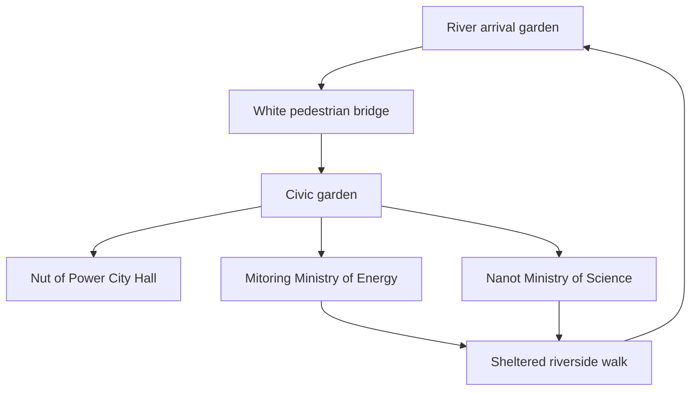

# Livistone: browser game implementation plan

Status: implementation plan following the design interview, 16 September 2026. The user approved the visual direction and confirmed exploration/lore, first-person walking plus a 3D aerial map, and desktop/mobile support from the start. The original STL jewelry models have been supplied; Grasshopper files remain optional. The engine choice below is made under the user's delegation. A first procedural prototype now implements town walking, the bridge, ground-floor interiors for all three landmarks, six discoveries, two artifact interactions, local journal persistence, an aerial map, and desktop/touch input. See the README for Bun setup and running instructions. On 17 September 2026 the original STL models of the Mitoring and the Nanot were supplied and placed in `data/models/` (git-ignored because of size); their preserved wire centerlines (about 40 KB of JSON) are rebuilt as silver ribbons around the Ministry of Energy and Ministry of Science. Recovery restored missing jewelry exports and repaired mouse handling. Desktop rotation now requires holding the left button throughout a drag; WASD and arrows independently control walking, and startup/resume never capture the mouse. The Mitoring is a lower, elongated 28 × 13.2 m amber hall with folded cristae visible from the aerial map. City Hall now has walnut relief, a dark seam, and broad brass clasps with hexagonal fasteners, based on the pendant photographs. The historical strand extractor was not present in the recovered tree. The STLs themselves are not loaded at runtime. The multi-room interiors, authored GLB assets, and physical-device performance targets below remain roadmap work.

## 1. Product direction

Build a small, beautiful, explorable town that opens from a normal web link on desktop or mobile. Players arrive beside the river, walk through green streets, cross bridges, and physically enter the three jewelry-inspired civic buildings. Interiors have real floors, rooms, windows, doors, and views back into the town. A 3D aerial map lets players inspect the settlement and orient themselves without losing their walking position.

The approved [town overview](../concepts/01-garden-town/images/01-town-overview.png) and [design brief](../concepts/01-garden-town/brief.md) establish the art direction: welcoming art-and-science fantasy, smooth white sculptural architecture, fresh greenery, intimate sheltered spaces, and the distinctive jewelry forms. The image guides appearance; we must design a consistent three-dimensional layout and floor plans from it.

Confirmed landmarks:

| Building | Identity to preserve | Proposed explorable spaces |
| --- | --- | --- |
| Nut of Power — City Hall | Joined walnut and smoky crystal halves, broad brass connections, dominant civic position | Sheltered entrance, public atrium, council room, garden-facing balcony |
| Mitoring — Ministry of Energy | Warm amber enclosed by irregular folded silver-white ribs | Public energy hall, a small interactive energy exhibit, enclosed winter garden |
| Nanot — Ministry of Science | Rounded volume with angular, nonuniform silver-white lattice and restrained dark inclusions | Public science gallery, an accessible demonstration laboratory, planted reading court |

Interior functions beyond the ministry assignments are design proposals. We will preserve the distinction between source lore and new game fiction.

## 2. Technology decision

Use **TypeScript, Vite, Three.js, and Rapier 3D physics compiled to WebAssembly**. Use Blender for authored meshes and glTF/GLB as the runtime asset format. Start with Three.js `WebGLRenderer` on WebGL 2.

This choice keeps the application in the browser's ordinary development ecosystem, makes custom architectural geometry straightforward, and uses WebAssembly for collision and physics work through Rapier. Rapier's JavaScript distribution is itself a WebAssembly module. [Rapier installation documentation](https://rapier.rs/docs/user_guides/javascript/getting_started_js/)

| Option | Assessment for Livistone | Decision |
| --- | --- | --- |
| TypeScript + Three.js + Rapier | Direct control over architecture, materials, web interface, asset loading, and the modest game systems this first release needs | Selected |
| TypeScript + Babylon.js | A strong alternative with integrated physics, character-controller, navigation, and game-oriented systems | Viable; the initial scope does not require adopting its broader engine conventions |
| Rust + Bevy compiled to WebAssembly | Viable if the project develops substantial simulation or prioritizes a Rust codebase | Adds a Rust/browser integration workflow without a demonstrated need for this primarily visual exploration game |

The comparison is a project judgment, not a claim that one engine universally performs better. Babylon's documented engine features include Havok physics and character control. Bevy publishes browser examples. [Babylon specifications](https://www.babylonjs.com/specifications/), [Bevy browser example results](https://example-runs.bevy.org/)

Start with the established WebGL 2 renderer so the initial project has one rendering path to validate. Three.js documents `WebGPURenderer` with a WebGL 2 fallback, but also notes material/postprocessing compatibility differences and remaining experimental behavior. Evaluate that renderer later against an actual Livistone scene; switching is a separate tested task. [Three.js renderer guidance](https://threejs.org/manual/en/webgpurenderer)

Writing the whole application in Rust would not by itself solve foliage overdraw, costly glass, large downloads, or poorly optimized meshes. Profile those costs before introducing a second application language.

Implementation stack:

- TypeScript with strict checking, Vite, and a committed package lockfile.
- Three.js for rendering and scene management; plain HTML/CSS for menus, readable lore panels, and settings.
- Rapier with a kinematic capsule for walking and separate simple collision geometry.
- Blender source assets exported to GLB; Meshopt geometry compression and KTX2 textures where the measured savings justify them.
- Small versioned JSON definitions for world zones, interactables, lore, and saved progress.
- Vitest for a few meaningful logic tests and Playwright for browser smoke checks, alongside manual graphics and movement review.
- Static HTTPS hosting for the proposed single-player release; no account or application server is necessary for that scope.

Choose and pin compatible package versions at implementation time. The renderer, asset decoders, and physics initialization must pass a small compatibility scene before detailed production.

## 3. Confirmed first-release scope

The confirmed scope is **exploration and lore, first-person walking plus a 3D aerial map, on desktop and mobile browsers from the beginning**. Single-player is the implementation choice for this exploration release.

The player can walk through the whole civic garden district and all three primary buildings, inspect the artifacts, and discover approximately six to nine short lore interactions. Exploration is welcoming and unhurried. A small optional route can connect the buildings, with one hands-on exhibit in each ministry. Doors to the principal buildings are available without completing a quest.

Start with roughly 10–14 supporting homes or workshops, built from a small modular kit. These establish the town and initially provide exterior streetscape; three complete landmark interiors take priority. More homes, Livia's personal workshop, residents, and additional districts can follow.

A short optional discovery sequence could be: inspect the artifact relationships in City Hall, adjust an amber energy exhibit at Mitoring, inspect a molecular model at Nanot, and record the discoveries in a journal. These are proposed game interactions, not literal demonstrations of medical efficacy.

Combat, multiplayer, city management, procedural infinite terrain, live AI characters, and a full seasonal simulation are separate expansions. A later multiplayer version would require a separate plan for authoritative session state, replication, reconnect behavior, identity, and hosting.

## 4. World layout and scale

Begin with an approximately **220 × 180 metre** playable district, bounded naturally by planted slopes and riverbanks. This is a blockout target, not a fixed measurement inferred from the illustration.

Place arrival on the near riverbank so the first player view recalls the approved overview. A modest bridge leads into a compact civic garden. City Hall occupies the main sightline, Energy sits to one side, and Science to the other. A loop through covered walks and river gardens connects all three.



This is a route diagram, not the final geographic map.

Use metres throughout. Block out a player eye height around 1.65–1.7 m and a comfortable walking speed around 3 m/s. Initial landmark dimensions can range from roughly 18–28 m across and 10–18 m high, adjusted after walking the scene. Avoid copying the illustration's proportions so literally that ordinary doors become enormous or stairs become unusable.

Draw floor plans and sections before detailing landmark shells. Every visible entrance needs an actual opening and valid circulation. Floors must fit inside the curved envelopes. Trees, overhangs, courtyards, and interior winter gardens should create visible shelter rather than merely decorate an exposed plaza.

## 5. Turning jewelry and concept art into 3D assets

No model files were found in the two repositories during the initial inventory, so the blockout started from photographs and the concept. Two STL files have since been supplied and sit in `data/models/` (`+3mito.stl`, the Mitoring, ~985k triangles; `bila.stl`, the Nanot, ~2.2M triangles). Their measurements and structure are recorded in [concepts/02-jewelry-models/notes.md](../concepts/02-jewelry-models/notes.md). The solids stay offline; only their extracted strands (`src/world/strands/`) ship, and the halls, floors, doors, and colliders are built around them in code.

Original jewelry models will improve silhouette fidelity, but they still need architectural adaptation: interior space, wall thickness, doors, floors, circulation, and optimized topology. A solid printable pendant cannot simply be enlarged into a finished building.

When files arrive, preserve them unchanged under an asset-source folder and record units, piece identity, and dependencies. STL is a triangulated source: verify scale, normals, density, and mesh defects; create optimized architectural surfaces and material/UV assignments. For Grasshopper, obtain referenced Rhino geometry and plugin requirements alongside the definition, or request a baked geometry export if its dependencies are unavailable. Neither Rhino nor Grasshopper should be required by the browser runtime. Convert usable assets offline to GLB and keep the blockout's doorway, floor, and interaction anchors stable when replacing it. [Three.js STL loader](https://threejs.org/docs/pages/STLLoader.html)

Use a hybrid production approach:

1. **Blockout:** parametric primitives and curves for terrain, paths, floor plates, shells, and recognizable landmark silhouettes.
2. **One finished sample:** author City Hall and its arrival garden with final materials and a real interior. Validate the export and lighting workflow in the browser.
3. **Landmark production:** create controlled curved surfaces and swept structural ribbons in Blender; keep editable source models and repeatable export settings.
4. **Town kit:** reuse several white shell houses, canopy segments, windows, railings, bridge parts, benches, and planters with controlled variations.
5. **Landscape:** use a small, coherent family of licensed tree and plant assets with multiple levels of detail. Track source and license information for all external assets.

Nut shell relief belongs mainly in surface textures and normal maps. Mitoring's irregular loops and Nanot's folded angular lattice must remain real silhouette geometry. Keep their distinctive patterns instead of replacing both with generic ribbed spheres.

Each landmark deliverable includes an editable source model, optimized exterior, independently loadable interior, collision meshes, doorway anchors, interaction anchors, simplified distant appearance, textures, and a manifest entry. Use a shared origin and transforms so exterior and interior meet exactly.

Asset metadata identifies nodes such as `door_city_hall_main`, `spawn_city_hall_entry`, and `interact_artifact_constellation`. Gameplay looks up stable IDs rather than guessing from mesh order.

GLTFLoader supports glTF and relevant compression/material extensions, with explicit decoder setup for compressed assets. Self-host the required decoder files and handle texture/mesh disposal when unloading zones. [Three.js GLTFLoader](https://threejs.org/docs/pages/GLTFLoader.html)

## 6. Walking, entering buildings, and interactions

Use a capsule character with collision-aware movement, gravity, slope limits, stair handling, and recovery to a safe location if the player falls outside the playable area. Pointer-lock controls handle looking; the physics controller determines movement. Moving the camera directly is insufficient for walking through an inhabited world.

Rapier provides movement correction, sliding, autostep, and ground snapping; these need tuning against Livistone's actual stairs and paths. Keep gravity and fixed-step integration explicit. [Rapier character controller](https://rapier.rs/docs/user_guides/javascript/character_controller/)

Desktop controls use held-left-button drag-to-look, independent WASD and arrow-key movement, E to interact, and Escape for the menu. Per the user's explicit preference, never request pointer lock: entering, resuming, key presses, and unpressed mouse movement must not change the view. Keep a drag alive across keyboard changes and mouse pointer-capture loss, and clear it on release/cancellation/focus loss or a mode change. Adjustable sensitivity remains future work.

Mobile controls are part of the first prototype: a left virtual movement stick, right-side drag-to-look, and large explicit Interact and Map buttons. Use independent pointer IDs so movement and looking work simultaneously; clear inputs on pointer cancellation, focus loss, and menu changes. Restrict gesture suppression to the game input surface so lore panels can scroll normally. Support landscape and portrait layouts with safe-area spacing and responsive controls; landscape can be suggested without being mandatory. Avoid requiring pointer lock or fullscreen on phones. [MDN pointer events](https://developer.mozilla.org/en-US/docs/Web/API/Pointer_events)

Use a fixed physics update with a capped catch-up accumulator and interpolated display transforms. Pause on focus loss and avoid a large movement jump when the tab resumes. Use ramps as simple collision surfaces beneath decorative stairs when that produces steadier walking. Decorative silver ribs should not turn into hundreds of snagging collision shapes.

Exteriors remain in a shared coordinate system. Prefetch an interior as the player approaches its building. The doorway opens only when that zone's geometry and collision are ready; if loading is slow or fails, show a clear status and retry action. Walking through the door preserves position, lighting continuity, and the view through exterior windows.

Do not unload a zone while the player occupies it. Retain a simplified interior appearance behind distant windows and cache the recently visited interior within a memory budget. Small vestibules and corners can conceal loading boundaries without making the main experience a sequence of teleport screens.

Interaction uses a short-range raycast and line-of-sight test. The nearest eligible object gets one concise prompt; walls prevent interaction through them. Lore appears in readable HTML panels with keyboard focus and a clear close action. Small progress records store stable discovery IDs, settings, and a safe saved location locally, with a reset option and graceful behavior if storage is unavailable.

### 3D aerial map

The map is an orbitable, zoomable 3D representation of the same city, with a player marker and selectable landmark names. Reuse the world placements with simplified exterior meshes, terrain, river, and tree clusters. Detailed interiors and fine foliage are not needed in map mode. This avoids loading or drawing the entire detailed town just to look at it from above.

Use one renderer/canvas and explicit `walking`, `map`, `lore`, `loading`, and `paused` modes. Save the player position and facing before entering the map, suspend walking input, and retain the occupied interior's resources. On return, restore the same location and orientation. Desktop Resume restores walking without turning the camera; the next held-button scene drag starts a new look gesture. Do not run both cameras as simultaneous full-screen renders.

Mouse orbit/pan/zoom and touch gestures control the map; provide visible zoom and reset-view buttons as alternatives. Clamp the camera above the ground and within sensible zoom limits. Three.js OrbitControls supplies the camera interaction foundation. [OrbitControls documentation](https://threejs.org/docs/pages/OrbitControls.html)

Selecting a landmark opens a short card and can highlight a route using a small authored path network. The initial design keeps map inspection separate from travel: resuming returns to the current walking position. Teleportation can be added later if desired. From an interior, the map marker indicates the building containing the player.

## 7. Rendering and atmosphere

Match the approved image through composition, scale, materials, and lush planting before adding expensive effects.

- Warm-white physically based surfaces, brushed silver, brass, walnut, smoky crystal, and amber establish the material family.
- One fixed late-spring daylight setup, environment lighting, baked interior illumination, and a limited dynamic shadow area establish the first release's lighting.
- Soft distance haze, subtle ambient occlusion where affordable, restrained tone mapping, and rich but natural greens support depth and atmosphere.
- A lightweight animated river surface provides gentle motion; omit real fluid simulation.
- Spatial river, leaf, and interior ambience begins after the player's initial interaction; all audio has volume and mute controls.
- Distinct courtyards and entry silhouettes orient the player without covering the view with navigation labels.

Glass and amber require special attention because they occupy large screen areas. Restrict costly transmission to nearby hero surfaces; use simpler tinted materials and environment reflections for distant versions. Test views looking through a building from both directions. Three.js explicitly notes the extra per-pixel cost of its advanced physical material features. [MeshPhysicalMaterial documentation](https://threejs.org/docs/pages/MeshPhysicalMaterial.html)

Use instanced vegetation grouped by spatial cell, distance-based detail, and reduced distant shadows. Avoid a single forest-wide instance group that defeats useful culling. Treat leaf overdraw and glass layers as first-class performance costs. [InstancedMesh](https://threejs.org/docs/pages/InstancedMesh.html), [LOD](https://threejs.org/docs/pages/LOD.html)

## 8. Architecture and repository structure

Keep the game runtime small and explicit. A full entity-component framework is unnecessary for the initial scope.

```text
src/
  main.ts
  game/          application lifecycle, fixed update, settings
  rendering/     renderer, lighting, materials, quality levels
  world/         zone loading, placement, terrain, asset manifest
  player/        keyboard/touch input, camera, capsule movement, safe recovery
  map/           simplified aerial scene, orbit controls, markers, route display
  interaction/   picking, doors, exhibits, discovery state
  ui/            menus, loading, accessible lore panels, journal
  audio/         ambience and positional sources
  persistence/   versioned local progress
content/         curated lore and interaction definitions
public/assets/   optimized GLB, textures, audio, decoder files
art/             editable source models and source asset records
scripts/         asset export/validation helpers
tests/           movement fixtures, logic and browser smoke tests
docs/            design decisions, asset specifications, test reports
```

Import curated lore into the Livistone content package with source provenance instead of depending on the live Livia website at runtime. Source editorial changes can then be reviewed deliberately. Keep user-interface state out of the per-frame render loop.

## 9. Performance and browser targets

These are provisional engineering targets, not measured results or guarantees. Mobile is a first-release requirement. Fix the benchmark devices during the initial prototype, including a representative midrange Android phone and an iPhone, plus a modest laptop.

| Measure | Initial target and test method |
| --- | --- |
| Mobile baseline | Aim for stable 30 frames/s on the reference phones, initially around 540p–720p internal rendering on the low tier; measure sustained behavior after ten minutes |
| Modest integrated-graphics laptop | Comfortable 30 frames/s at a suitable quality tier; aim for 95th-percentile frame times under 33 ms during the reference route |
| Midrange desktop/laptop | Aim for 60 frames/s at 1080p on the reference route |
| First playable download | Aim for 6–10 MiB compressed, including entry area and runtime/decoders; defer detailed interiors and higher quality textures |
| Time until movement | Aim for under 15 seconds at 10 Mbit/s on a reference phone with a cold cache, and under 10 seconds at 30 Mbit/s on desktop; measure decoding and startup too |
| Scene workload | Begin around 200–400k visible triangles and under 120 draw calls on the mobile tier; 0.5–1 million and under about 250 on desktop medium; revise from actual costs |
| Textures | Shared 1K/2K sets by default; compressed textures, limited unique hero maps, and bounded loaded zones |
| Aerial map | Similar or lower GPU/memory cost than walking; simplified whole-town proxies rather than all detailed buildings at once |
| Browser coverage | Desktop Chrome/Edge, Firefox, and Safari; Android Chrome and iOS Safari on actual reference devices |

Triangle and draw-call counts are diagnostic budgets, not a substitute for frame-time measurements. Record the machine, browser, resolution, quality, loaded zones, frame-time percentiles, download size, and memory behavior. Publish the tested device matrix; desktop browser emulation does not establish real phone performance.

Use adaptive resolution and shadow/foliage tiers. Profile a worst-case view with all three landmarks, dense trees, and visible glass; also profile entering and leaving each interior. Test resource disposal by repeating the full route several times and checking for growing memory use.

On mobile, cap internal pixel density, prefer baked shadows and simpler glass, keep only nearby detailed zones, and limit large transparent layers. Handle orientation/viewport changes, background suspension, and WebGL context loss with a recoverable loading state. Suspend rendering while hidden and avoid rendering unnecessary frames in a stationary aerial map. Measure resource allocations and dispose of unused meshes, textures, and render targets. [MDN WebGL guidance](https://developer.mozilla.org/en-US/docs/Web/API/WebGL_API/WebGL_best_practices)

## 10. Delivery milestones and acceptance gates

| Milestone | Concrete deliverable | Gate before expanding |
| --- | --- | --- |
| 0. Technical spike | Browser scene with representative white ribs, amber glass, foliage, GLB loading, Rapier movement, keyboard/touch controls, and an aerial camera | Rendering, decoders, physics, and camera-mode switching work on reference desktop and phone browsers; baseline performance recorded |
| 1. Walkable blockout | River, bridge, routes, three recognizable landmark shells, City Hall floor plan/interior, and a basic 3D map | Walk from arrival into City Hall and back without clipping or getting trapped; inspect the map and resume at the same position on desktop and touch |
| 2. Finished sample route | Polished arrival garden, one bridge, City Hall exterior/atrium, materials, lighting, sound, and one lore interaction | Compare concept and street-level views; validate visual direction and sustained phone/laptop performance |
| 3. Complete civic district | Energy and Science buildings with interiors, supporting homes, paths, and gardens | All three buildings are enterable, spatially consistent, and connected by a comfortable walking loop |
| 4. Playable discovery layer | Journal, six to nine interactions, optional discovery sequence, map landmark cards/routes, saved progress, settings, and loading/error handling | Complete the route, reload, recover progress, and reset with keyboard/mouse or touch; no mandatory task prevents free exploration |
| 5. Browser release candidate | Compression, detail levels, quality settings, movement fixes, responsive interface, accessibility checks, and reproducible build | Pass the desktop/mobile device matrix, sustained performance check, and full traversal checklist; build is ready for hosting |

The first milestone worth showing is an actual walk into City Hall. The finished sample route is the major quality gate: if it cannot retain the intended architectural character within the browser budget, adjust art production before multiplying assets across the town.

Do not estimate a polished-town delivery date from the concept image alone. Estimate the remaining landmarks after completing the sample route, when modeling/export effort and performance costs are known. This is likely to be an asset-production-heavy project rather than a mostly engine-coding project.

## 11. Validation and deployment

Automate only checks with useful failure signals: movement through a doorway and over stairs, ground collision and safe recovery, interaction occlusion, walking/map state restoration, simultaneous touch inputs and cancellation, discovery state transitions, save-version handling, missing-asset recovery, and a browser startup/route smoke test. Add an asset check for missing textures, inconsistent transforms, required anchors, and published file sizes.

Manually review full traversal, glass from inside/outside, material continuity, motion comfort, foliage quality, window views, sound, keyboard/menu behavior, touch ergonomics, map gestures, orientation changes, and phone background/resume behavior. Browser automation does not substitute for visual review or real-device performance testing. Arrange actual-device testing or a suitable device-testing service before calling mobile support complete.

Build with Vite and serve the static output over HTTPS, with correct WebAssembly/asset MIME types and caching. Host runtime assets and decoder files together; verify path handling on the chosen host. Vite documents its production build output and static deployment workflow. Hosting provider and publication are later execution decisions. [Vite static deployment](https://vite.dev/guide/static-deploy.html)

The first version can be a standalone Livistone URL linked from Livia's site. Prefer top-level navigation initially, since embedding a game adds focus, pointer-lock, and sizing considerations.

## 12. Interview decisions and next action

1. **Gameplay:** explore the town and all three civic buildings, discover lore, and interact with a few objects.
2. **View:** first-person walking and a 3D aerial map.
3. **Devices:** desktop and mobile browsers from the beginning.
4. **Assets:** the user can supply STL files and possibly original Grasshopper files later.

Begin implementation with milestones 0 and 1: prove the browser rendering/physics/asset pipeline, then produce the playable river-to-City-Hall blockout with touch controls and the aerial map. This can proceed before the original jewelry files arrive. Detailed landmark art should incorporate those files when available, without making the browser depend on the original design software.
