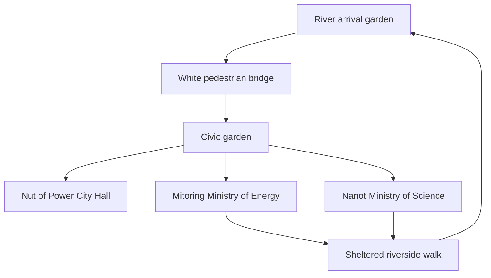
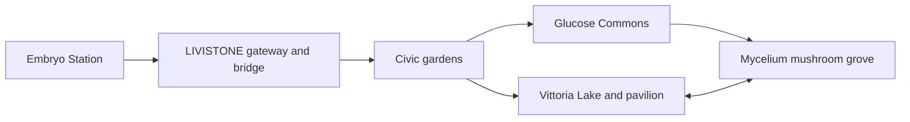

# Livistone: browser game implementation plan

## Summit view, mountain trees and device detection — 6 October 2026

From the Jepii Mici plateau the desktop (gpu) view now clears to 330 m and shows the whole town, the lake garden and the halls; trees beyond 160 m there are baked cards, which keep that view's triangles near the rest of the trail's (about 5M in `plateau-view`, against 6.75M without them) though it draws about 500 times a frame. Spruce and larch take over the slopes from about 15 m and dwarf pines grow on the high ground round the gorge; the gorge's crags are rougher and less regular; tall rock in front of cloud no longer shows the clouds through it, after a fix to the sky's mip levels. See `docs/realism/27-mountain-trail.md` (round 3). Measured headless on one laptop and on its RTX 4090 through Chrome's Vulkan flags (about 40 fps on the plateau); weaker desktop GPUs and every phone are untested for that view, which phones never take.

Graphics detection: Auto picks Rich on flagship phone GPUs (tested on one Android phone, a HONOR Magic8 Pro), Balanced no longer caps the frame rate at 30 fps, and the graphics dropdown names the GPU drawing the town and, on Linux Chrome without WebGPU or with hardware acceleration off, the setting that holds it back (README). The music button now reads off while the browser blocks autoplay.

## Progressive loading — 6 October 2026

Visitors reported long loading, some leaving before the town appeared. The town now builds only what the walking view can reach from the station before it shows; the lake garden, Future House, the Enhancement hill, both eye gates, the concept rotunda and the Jepii Mici trail (crags, signs, alpine plants, water) build after the first view, one at a time, nearest the player first, each with its collisions, reflections, night lights and shaders prepared before it appears (`src/world/town-parts.ts`; AGENTS.md describes the rule). Parts declare circles from their own layouts, so a new building needs only a footprint, and one without stays in the first load. A teleport or map jump to a part still on its way waits for what stands within half the view of its arrival ("Preparing …"), about 7–12 s right after the first view on this laptop, nothing once the parts are in. The garden's paths reach into the first view, so the town builds them with the arrival area.

Production build, fresh headless Chrome with hardware WebGPU per run, one laptop, three alternating runs each against `main` before the change (not device timings): time until the town appears fell from a median 17.6 s to 13.4 s on Balanced and from 21.2 s to 17.0 s on Rich; frame rates in the 30 s after it are unchanged, but the parts streaming in add a few pauses of 0.4–0.9 s there (before: 0.15–0.33 s). Shader preparation for the arrival area (about 6–7 s) now dominates loading. Painted textures (posters, captions, signs, atlases) were part of it: each GPU-backed canvas uploaded as a synchronous readback, 1.1–1.8 s in all on the dev server's Balanced profile; with CPU-backed canvases (`bootstrap.ts`) the same uploads take about 0.05 s and the 92% stage fell from 3.7–5.8 s to 2.8–3.3 s in paired dev-server runs (headless, noisy). Next steps are in `docs/realism/NEXT.md`. A simulated walk from the station across the bridge to City Hall while the parts stream in, teleports into each distant area, a night load, the WebGL 2 fallback and the cpu tier ran without errors (`tests/progressive.spec.ts` keeps the walk and a teleport).

## Saved reflections that load, and music on the loading screen — 6 October 2026

The committed reflection probes had never matched committed source: their manifest named a revision no commit produced, so every page (dev, local preview and the deployed site) ignored them and baked every probe live after the welcome screen, rendering the town a second time per frame for roughly 40–50 s. The probe digest now covers only what a bake can see (scene, renderer and lighting code, the Game methods the bake runs, maps, models and the three version), so HUD, menu and stylesheet changes no longer invalidate it; the lighting constants moved from `main.ts` to `src/render/scene-light.ts`. `scripts/check-probes.ts` compares the manifest with the sources and checks every atlas; the pre-commit hook (when a staged path feeds the digest) and the pre-push hook run it, `bun run build` warns on a mismatch (`PROBES_STRICT=1` fails), and a page that rejects the files says so once in the console. All eight sets (both backends, both detail levels, day and night) were rebaked; with progressive loading below, the committed revision is `8f4d8772adb3c439`.

Local headless check (one laptop, Chrome with hardware WebGPU, gpu tier, 1280 × 800, dev server, two runs each of a day and a night load; not device timings): before, `saved` was empty and the live bake ran 10–23 s past ready, with 7–10 fps in the first 10–15 s and a 30 s mean of 9.4–11.2 fps; after, the saved set restored on every run, nothing baked after ready, and the 30 s mean was 11.7–12.7 fps with no dip. Time to ready did not change measurably (21–23 s before, 21–26 s after): on this machine it is dominated by building the town on the CPU (about 13 s) and compiling shaders (about 7.6 s), which remain the main loading cost. The deployed server now sends `immutable` caching for hashed `/assets/*` files and probe atlases, which helps repeat visits only.

The loading screen has a music button beside the progress count. The radio starts with the page rather than with the game, the button turns it on or off while the town loads, and the game's speaker and menu toggle keep that choice. Autoplay rules still defer playback to the visitor's first gesture.

## Garden concepts and owner review — 5 October 2026

The east exit of Eyelense connects to a level circular concept terrace with fifteen inward-facing posters suspended in rounded garden arches, climbing leaves and layered three-dimensional flowers. The five existing generated concepts are preserved; ten missing concepts now use newly generated images based on the original building briefs. The source PNGs remain untouched and compressed WebP derivatives record their provenance. The terrace and connection share planting reservations, terrain grading and collision.

The floating Mycelium ring has dedicated night emission and a pooled light. Jepii Mici has sparse, drifting, bodiless light sprites, with their nearby pooled lights following the same positions and reduced-motion clock. The Dewdrop briolette has outward facet normals and clear topaz optics, a faint glow and a concave coiled silver band inspired by the supplied Swiss Blue STL; a 16k-triangle derivative of the original setting appears on its source stand. Eye of Winter’s inner topaz also has corrected outward normals and polished dielectric reflection/refraction instead of opaque metallic blue.

The top toolbar stays visible on desktop and touch, including quick music, teleport and graphics icons. Graphics offers Auto/Lightweight/Balanced/Rich and names the resolved Auto preset in its tooltip. The bottom desktop controls hints fold after six seconds of walking, defer while a hint control is focused, and stay open when manually reopened. Map numbers keep fixed anchors with fine lines and subtle ground glows; labels appear on hover/focus without moving neighbouring markers. Eye of Winter has soft structural night emission without exterior lamps. Older Intel HD graphics now select a lighter rendering path automatically; the Performance menu offers persistent manual choices. Same-machine headless Chrome walking samples improved from 5–7 fps to about 29–30 fps, with reduced materials and resolution. This is not a measurement of the embedded browser or other devices. Verification results are recorded in `docs/realism/29-owner-gardens.md` and `docs/realism/30-garden-arches.md`.

## Teleport dropdown and creator links — 4 October 2026

A compact compass button beside sound opens a scrollable dropdown of all 13 destinations in visitor-route order, using the same clear entrances and facing directions as map arrivals. Opening it pauses walking and map controls; choosing a stop resumes first-person exploration there. Escape, closing it, pressing its toolbar button again or clicking outside preserves the previous walking or map view and position. Keyboard navigation includes Tab, arrow keys, Home and End, with focus restored to the teleport button when cancelled. On phones up to 440 px wide, the six navigation tools have their own row below the Livistone name. Menu, Journal and the creator story link directly to liviazaharia.com; existing individual-work source links remain available.

Verification: production build and 268 Vitest tests pass. Seven relevant Chrome browser scenarios pass across the final WebGL 2 runs, including desktop/touch navigation, all 13 teleport arrivals, responsive widths from 360 to 1280 px, keyboard dismissal and day/night controls. The headless WebGPU attempt timed out during town loading before navigation was enabled; physical phones and Safari remain unverified.

## Eyelense E — playable east-meadow passage, 4 October 2026

Eyelense now stands beyond Science at `(106, −36)`: the uniformly enlarged source crescent is glossy black, with raised swirl relief and brass threading. A substantial rounded red bead has a 4.2 m-wide, 4.4 m-high arch with a continuous tunnel lining. Its clear glass surround leaves the route open. Connected paving reaches the level limestone forecourt and benches, with matching solid colliders and full planting clearance. The separate curved smoky lens follows auto/day/night and becomes clearer at night; reduced graphics retain opaque reflective glass and the same passage. Map arrival and a source-backed journal story preserve the original jewellery in Future House. In-world captures, geometry provenance and the exported GLB are recorded under `concepts/15-moon-gates/models/`.

## Eye of Winter — first building study, 4 October 2026

The approved Winter G concept now has a first 3D building on the new snowy shelf above the Jepii Mici chimney, at (−78, −283): source silver preserved, a clear outer quartz envelope, smaller blue faceted stone, six-leaf entrance iris, usable room and connected approach. Rendered and physical door states advance together in the fixed walking loop. Concept images and the derived model carry provenance under `concepts/15-moon-gates/`; the broad snowfield, boot-print approach, terrain collision and rim ropes now connect it to the chimney. Material polish remains for review.

## Saved reflections and loading — 4 October 2026

Building reflection probes can now be baked ahead of time and shipped as gzip-compressed half-float PMREM atlases, preserving their HDR values and filtering. `bun scripts/build-reflection-probes.ts webgl` and `webgpu` generate day/night sets at the existing 256/128 px quality levels. Backend-specific files preserve each backend's readback convention. Start a fresh dev server after changing town sources before regenerating. Use `PW_HEADED=1` when headless Chrome cannot initialize its hardware WebGPU adapter. A source-and-texture digest rejects outdated sets; missing or damaged files fall back to the existing runtime bake. Initial loading requests only sites within 80 m of spawn; the remaining files load on approach. Captures load every site so comparisons stay deterministic. GPU shader pipelines still compile on the visitor's device, with repeated plain meshes sharing one material/layout preparation, remaining work distributed across six workers, and progress shown through that stage.

Hovering gallery GLBs leave the critical loading path and load within 70 m of a collection (20 m ahead of its visibility range); capture and pinned-piece modes retain complete models. A small placeholder prepares the material and its probe before a model arrives. The first complete walking frame, including its nearby night lights and shadow box, finishes on the GPU before the introduction disappears. The scene and physics remain available across the whole town from startup. Day and night are the implemented lighting phases; dawn/dusk would need their own lighting definitions and saved sets.

Local timing check (headed Chrome with hardware WebGPU, mobile tier, 1280 × 800, no network throttling; two alternating runs per strategy before integrating the remote incremental-probe rewrite): the previous group-based shader warm-up plus live probes took a median 8.43 s from 92% to ready; the material/layout queue plus saved probes took 6.14 s (27% less). Shader preparation alone fell from 6.84 s to 5.44 s. Total startup was 15.41 s versus 13.70 s. Ordinary startup requested three reflection files, about 1.69 MiB including the manifest; the entire saved library is not downloaded at once. These are local diagnostics rather than measurements of the deployed site or physical phones. Saved-versus-live captures at the gate, station and City Hall remained visually consistent on both backends. Validation after integrating the remote reflection rewrite: build, 259 unit tests, and targeted loading, poster and day/night browser checks on WebGL and WebGPU. Pixel comparisons and timing records are under `output/testing/loading-comparison/`.

## Haze into the distant ranges (realism 21 follow-up, branch `realism/21-haze`) — 4 October 2026

The walking haze no longer settles on one pale horizon colour. Its last stretch fades into what the distant pass drew behind each surface (the sky, the ranges and their valley mist), so far trees, the town's ridges inside 130 m and the Enhancement hill seen from the lake dissolve into the mountains behind them instead of standing as pale cut-outs; the hill now disappears from that view, as anything at its distance does. Trees stop at 90% of the full-fog distance (117 m desktop, 99 m mobile), where the haze has already taken most of them; a frame pair either side of the cull shows no visible pop. At night the Mitoring's amber keeps its hue: its own highlights ease off past a knee and the night halos blend as a screen, so the front lamps no longer leave peach-white blots (near-white pixels in `energy-front` 2.5% → 0.4%, inside the hall 21% → 0%); by day the amber is untouched. One extra full-screen copy of the distant pass per walking frame (+1 draw call); the tree reach and the haze both accept a full-fog distance given each frame, for a longer view on high ground later. Headless captures against `main` (not device benchmarks): pixels changed by more than 20 levels, median desktop day 0.85%, touch 0.79%, night 1.6%; desktop triangles 2.70M → 2.50M (median), touch 1.02M → 0.94M. Dev-only `?haze=classic` shows the previous look. Physical devices, Safari and Firefox remain unmeasured.

## Your time, day and night in the top bar (realism round 3, task 1, branch `realism/r3-time-button`) — 3 October 2026

The time of day, until now only a select in the menu, also has a top-bar button: a compact icon button beside the speaker cycles your time (the visitor's clock, still the default), day and night with one click or T, shows a clock, sun or moon, and names the mode, for your time with what the clock gives now. The menu keeps the same choice as "Your time — local clock", Day and Night, the two follow each other, and saved choices (`livistone-time-of-day`) carry over. A switch holds the main thread and the GPU for a while (headless on the development laptop, not device timings: about 3 s for the first switch to night and 1–1.6 s for later ones on WebGPU, 16 s and 2–3 s on the WebGL 2 fallback), so the button shows it as pending, a pulsing icon (still and dimmed under reduced motion), from before the phase is applied until a frame of it has finished on the GPU. On phones the five tools keep one row from 360 px wide. `tests/time-of-day.spec.ts` covers desktop and touch emulation on both backends; physical phones, Safari and Firefox are untested.

## Contrast, aerial perspective and Neutral tone mapping (realism 21, branch `realism/21-on-round-2`) — 3 October 2026

The owner chose [sub-plan 21](realism/21-contrast-aerial.md)'s moderate contrast and Khronos PBR Neutral tone mapping; the other variants and their switches are gone. The sun is stronger against a weaker sky fill, so cast shadows read as shadows (shade about a third darker, sunlit ground as before; moonlight likewise; emissions unchanged). Walking on the gpu and mobile tiers, a height-aware haze in linear light fogs the town toward the sky behind each surface, slightly bluer with distance, and is complete at 130 m (gpu) or 110 m (mobile); that distance is also the walk camera's far plane and where trees and mushroom crowns are culled, so nothing vanishes before it is entirely haze. The distant ranges keep their valley mist, and low far silhouettes fade toward that mist rather than the open sky. The output pass maps with Neutral, matched to the old ACES look at middle grey; paper keeps its exact colour. The map and the cpu tier keep their range fog. Headless captures against `main` (not device benchmarks): pixels changed by more than 20 levels, median desktop day 31%, night 4%, touch 27%, software 15%; draw calls within a few per view; desktop triangles 2.0M → 2.7M (median), mobile 0.81M → 0.98M, because trees now draw until full fog. Awaiting owner review; the Enhancement hill seen from the lake now fades into a flat haze shape, and the Mitoring's amber highlights whiten at night under Neutral.

## Physical sky and distant mountains (realism 26, branch `realism/26-sky-mountains`) — 3 October 2026

At the owner's request the sky and the mountains move toward realism ([sub-plan 26](realism/26-sky-mountains.md)). The day sky is baked once from a single-scattering atmosphere with ray-marched, self-shadowed cumulus; the night sky has graded stars, a faint Milky Way and a moon with maria. One gain keeps its horizon on the fog colour, and golden hour can reuse it by changing only the sun direction. On the gpu and mobile tiers, eroded mountain ranges beyond the town's 520 m terrain, bluer and hazier with distance, draw in a second camera pass from their own small scene; the town's fog, far plane and draw list are unchanged, and the cpu tier has no distant pass. The town's ridges gain eroded gullies and grey limestone strata, while paths, entrances, rails, portals and the seeded woodland keep their positions. Headless captures (not device benchmarks): three to six more draw calls per walking view (desktop mean 148 → 151, worst view 247 → 251), about 0.1M more triangles on desktop, time to ready unchanged within noise. Not yet reviewed by the owner; physical devices, Safari and Firefox are unmeasured.

## WebGPU renderer — 3 October 2026

Realism sub-plan 20 moved the game from `WebGLRenderer` to three r186's `WebGPURenderer`: WebGPU where the browser offers a hardware adapter, its built-in WebGL 2 backend everywhere else, including software adapters. Every shader is TSL; classic and its GLSL patches are gone. One output pass keeps the classic look: the classic ACES fit, fog toward the displayed horizon mixed after tone mapping, and exact paper and sign colours through a display mask. From inside, the Mitoring amber and the Nut of Power crystal keep the second layer of themselves that classic's transmission pass drew, and night halos add their displayed colour. The parity gate passed on both backends against classic `main` (review page `review/20-webgpu-b/`; pixels changed by more than 20 levels, median per view set): desktop day 1.9% and night 1.0%, touch 0.4%, fallback desktop 2.0% and touch 0.5%, no view over 10%; software 9.3%, with three views at 10–12% from the cpu tier's low render scale and linear-light blending of reduced glass. Paper and sign pixels match exactly; the fully fogged horizon is within 0.4 levels on average. Across all 33 desktop views, draw calls per frame fall from 611 to 296 by day and from 660 to 344 at night, because WebGPU needs no transmission pre-pass.

Measured on the development laptop's integrated GPU in headless Chrome (WebGPU through the Linux flags in `playwright.config.ts`), dev servers, view `arrival-meadow`, three interleaved runs per row (median). These figures are informational, not a device benchmark; physical phones, Safari and Firefox remain unmeasured.

| Profile | Renderer | Draw calls | Triangles | Headless fps | Time to ready |
| --- | --- | --- | --- | --- | --- |
| Desktop (gpu tier) | Classic `WebGLRenderer` | 591 | 6.9 M | 4 | 15.5 s |
| | WebGPU | 280 | 3.6 M | 18 | 12.4 s (0.80×) |
| | WebGL 2 fallback | 280 | 3.6 M | 5 | 15.4 s (1.00×) |
| Touch (mobile tier) | Classic | 288 | 1.5 M | 16 | 9.5 s |
| | WebGPU | 279 | 1.6 M | 27 | 9.4 s (0.99×) |
| | WebGL 2 fallback | 279 | 1.6 M | 12 | 10.5 s (1.11×) |
| Software (cpu tier) | Classic | 152 | 0.9 M | 3 | 8.9 s |
| | WebGL 2 fallback (no WebGPU adapter) | 154 | 0.9 M | 3 | 11.7 s (1.32×) |

The main JavaScript chunk grows from 1,397 kB (447 kB gzip) to 1,741 kB (557 kB gzip) with WebGPURenderer's node system. Time to ready is from navigation to first-person play; it includes building every shader at load (about 1.9 MB of WGSL in 134 modules on WebGPU), so walking never stalls on a shader the first time an object comes into view.

## Gallery posters (realism 12) — 3 October 2026

The 41 poster photographs show the jewels in their own colours: the catalogue derivatives replace the studio's white sweep with the poster paper (`scripts/paper-background.mjs`, from the archive originals), instead of the paper colour multiplying the whole photograph. Grey, dark and scenic backgrounds (eight photographs) are kept. Each poster now stands in a thin bevelled brass rail on a lit board, and its caption carries a subtle baked picture-light pool; the paper itself stays unlit and exactly `#f4f0e5` by day and night. Draw calls are unchanged (frames, rails and feet merge per collection).

Full thumbnails and captions now exist only for the two collections the visitor last approached; the others keep 96 px photographs and 128 px captions for distant views. Captions are 640 px wide on mobile and cpu. Poster texture memory, headless and including mip chains: 223 MiB on every tier before; after, 42 MiB at the station and at most 100 MiB on gpu, 29 MiB and at most 67 MiB on mobile and cpu. Not measured on a physical device. Dev-only `?posters=all` keeps every collection resident.

## Ambient occlusion and bloom (realism 18) — 3 October 2026

On the gpu tier the output pipeline now adds screen-space ambient occlusion and a restrained bloom, both in linear light before tone mapping. GTAO runs at half resolution on a depth and normal copy of the walk camera's frame, then a denoise. It darkens corners, kerbs, stand feet, foliage and the walnut and silver folds, and fades with the fog. Bloom takes only exposed radiance above the tone mapper's near-white, with a per-pixel cap, so the neon gate, lamps and lit signs glow at night without washing out. Paper, photographs, captions and signs keep their exact colours (`tests/post.spec.ts`). Mobile and CPU tiers run neither. The map and the Gentle setting skip the occlusion but keep the bloom.

Measured with WebGPU timestamp queries on the development laptop's integrated GPU in headless Chrome at 1280×800, gpu tier forced, other jobs sharing the GPU. These are informational, not device benchmarks.

| View | GPU ms per frame, off → on | Of which AO (depth copy, GTAO, denoise) | Bloom | Draw calls |
| --- | --- | --- | --- | --- |
| arrival-meadow | 2.1–2.3 → 6.8 | 3.8 | 0.7 | 135 → 150 |
| city-hall-gallery | 3.3–3.5 → 8.7 | 4.6 | 0.7 | 143 → 158 |

The stages also add 1.5–2 ms of main-thread time per frame and 27.8 kB to the main chunk (8.4 kB gzip). Headless frame rates on the shared GPU were too noisy to isolate the cost: 16–24 fps without, 13–16 with. A screen-space GI variant (SSGI, dev-only `?post=gi`) cost 14–20 ms of GPU time and stayed grainy without temporal filtering, so it does not ship. Physical-device cost is unmeasured.

## Wind and foliage edges (realism 17) — 3 October 2026

The near grass field's wind clock and gust field now move the rest of the planting on the GPU and mobile profiles. Tree crowns lean and rock slowly with the gusts at their trunks, limbs bob and leaf cards flutter, all growing with height in the tree; shrubs, flower borders, meadow tufts and the lake reeds bend from their roots. Each instanced plant takes its phase from its own instance matrix, through a per-instance root attribute refilled with the matrices, so neighbours never move in step. Everything is a TSL `positionNode` on the existing shared materials: no draw calls or triangles are added, the frozen `?capture=1` stills stay deterministic, and reduced motion holds the plants still. Shadow casters keep their rest pose, because the sun's shadow map is cached and only re-baked when visibility changes. Where the frame is multisampled (fine pointers), leaf cards use alpha-to-coverage with the coverage ramp centred on their 0.45 cutoff, so crown edges are smoother without thinning. The CPU profile is unchanged. The sculptural lake leaves and the silver mycelium grove stay still. Headless frame rates are informational only (`docs/realism/17-wind.md`); the vertex cost on physical phones is unmeasured.

## Reflection probes (realism 07) — 3–4 October 2026

Metal, glass, amber and gems on the building-pieces reflected only the baked sky. `world/probes.ts` bakes reflection probes: one cube from inside each building-piece (City Hall, the Mitoring, the Nanot, the Embryo ring entrance, the King's Chapel gateway, the Time Tower and Future House), with that building's envelope above 0.6 m hidden, and one at head height in each civic hall and on the station concourse. Each is prefiltered with the node `PMREMGenerator` and becomes the environment of that building's reflective surfaces (tagged metals and gems, any metal, glazing, transmissive stone); each separate quality tag (`gatewayGem`, `cityHallCrystal`, `mitoringAmber`, `stationAmber`, `hallGlass`) is kept. The probes see the town as the map does, trees at their walking detail, fogged as the walking view is, but without photographs, captions, near-ground details or night halos; exterior probes also draw the distant ranges (realism 26), as the walking view's distant pass does, so silver facing the valley shows the crests above the haze. The bake draws straight into the output pipeline's target layout and never runs the output pass, so ambient occlusion, bloom (realism 18) and the Neutral tone mapping (realism 21) apply once, to the final frame.

Since round 3 (branch `realism/07-probes-after-load`) loading bakes nothing. From the second frame after ready one face is drawn per frame, each site's prefilter is a step of its own, and each building shows its probe as soon as it is done; the night is then prebaked in the background (its sky first, in 15 steps), the scene in the night's state around each step. That night is provisional, its moon unshadowed, because the shadow map holds the sun's box for the walking view: the first switch to night shows it at once and bakes it again under the moon. A night load bakes the day only once it is shown. Every lit surface samples one environment node that picks each object's probe or the phase's sky, so materials shared between buildings are no longer copied and no day/night switch builds a shader (the first switch to night builds one, the halo's; it built 115 without probes and 177 with them). While the shown phase bakes, the walking view keeps the whole-town shadow box drawn during loading (15.6 cm texels instead of 4.9 cm), because the bake needs every building's shadow.

Sizes: gpu 256 px exterior and 128 px interior cubes, mobile 128 and 64, none on the cpu tier; prefiltered, about 50 MB of half-float GPU memory per phase on gpu (7 × 6.3 MB + 4 × 1.6 MB) and 14 MB on mobile. Measured on the development laptop's integrated GPU in headless Chrome over WebGPU, shared with other agents' work, three pairs interleaved with `?probes=off` (`scripts/probe-timings.ts`, fresh browsers; desktop forced to the gpu tier, touch emulation as mobile). Time to ready alone is mostly compile noise here, so the interval from the compile to ready is given too.

| | gpu | mobile |
| --- | --- | --- |
| Time to ready, probes / off, load-time bake (main at 0ea11ed) | 19.6 / 17.9, 19.7 / 20.3, 22.4 / 17.5 s | 15.4 / 11.8, 13.0 / 13.9, 13.0 / 14.2 s |
| From the shadow pass to ready then | 3.3–5.8 s against 0.5–0.8 s | 1.5–3.7 s against 0.3–0.4 s |
| Time to ready, probes / off, baked after ready | 14.3 / 14.0, 13.7 / 16.1, 12.4 / 13.6 s | 12.3 / 12.8, 13.3 / 11.6, 9.7 / 10.6 s |
| From the compile to ready now | 0.62–0.76 s against 0.58–0.69 s | 0.45–0.48 s against 0.60–0.65 s |
| Both phases baked after ready | 19–25 s (day 9.3–11.7 s) | 7.0–9.7 s (day 3.5–5.0 s) |
| Frames meanwhile: median, 95th percentile, longest | 83–133, 283–367, 417–483 ms (off: 83–133, 167–300, 167–483) | 17, 50–100, 100–283 ms (off: 17, 17–50, 100–300) |
| First switch to night, until three frames drew | before 3.8–4.2 s (off 1.3–1.9 s); now 0.18–0.55 s (off 0.28–0.92 s) | before 2.4–5.4 s (off 1.5–1.6 s); now 0.08–0.16 s (off 0.12–0.31 s) |
| Texture memory at ready, after the bakes, after the first night | 343, 548, 556 MB (off: 343, 343, 458) | 182, 232, 236 MB (off: 182, 187, 216) |

The load-time bake's cost was its main thread (1.4–2.8 s on gpu, about 70% of it `queue.writeBuffer`, every drawn object's uniforms again for each of 108 faces) and the first frame waiting for its GPU work, not shader builds: the per-building material copies added about 30 node builds but 4 pipelines. Each face now adds about 50–75 ms of this GPU to a frame on gpu and the night sky's prefilter (a 1024 px cube into a 3072 × 4096 map) makes the longest frame, as at the first switch before. Both phases' probes hold 98 MB on gpu (20 MB mobile), as before, but now on every visit within half a minute, together with the night sky (115 MB gpu, 29 MB mobile) that only the first switch to night used to create. Draw calls and triangles of the walking view are unchanged. Parity with the load-time probes on the `materials` view set, desktop day: at most 0.39% of pixels change by more than 20 levels. City Hall's views change more (`city-hall-gallery` 3.0%): the old bake drew its shadow map again at its first face, City Hall's envelope hidden, so the hall cast no shadow into any old probe. By night, after the first switch, the views change 0.05–6.3% of pixels by more than 20 levels, from the old night bake's own shadow map and game time. An offline prebake (rendered from a dev server and shipped per tier) is estimated at 1.5–15 MB of downloads depending on encoding and one to two days of work, plus a rebake after any change to a building, the sky or the haze; it was not built. Not done: the river probes the sub-plan lists for mobile water, and parallax-corrected (box-projected) interiors. The WebGL 2 fallback passes the specs; its timings and physical devices are unmeasured. Details in [sub-plan 07](realism/07-reflection-probes.md#after-load-round-3-task-2).

## Contact shadows (realism 16, WIP) — 3 October 2026

One multiply-blended decal batch, a single extra draw call, grounds trees (a crown-wide patch and a trunk contact), bank rocks, lamp posts, poster and stand feet, place signs, plinths and station benches. Terrain patches lie on the rendered 2 m terrain triangles; tree patches hide with their forest cell, and the batch hides in the map. Bank-rock patches reach past each rock's silhouette and fade out toward the waterline (before the October fix they lay hidden under the rocks on every tier). The gpu tier builds 2,316 patches (51.8k triangles), the mobile and cpu tiers 1,328 (29.2k); only nearby forest cells are drawn. The terrain also bakes a `groundShade` attribute under crowns, beside trunks and along building walls, which the ground material applies as ambient occlusion to indirect light only. Checked in headless Chrome on WebGPU (and earlier on the classic renderer); the WebGL 2 fallback, review captures and physical-device performance are still to come.

## Architectural surfaces (realism 24) — 3 October 2026

The bridges, gateway abutments and hall rims now use a generated pale limestone ashlar; the Ministry of Science entrance arch is cast in the Nanot lattice's silver instead (October 2026 owner report). The civic hall floor insets use a honed terrazzo with brass strips every metre, and the town's gold, poster stands and sign frames use a brushed-brass roughness map. `scripts/build-surface-textures.py` bakes all three sets procedurally from fixed seeds, with no photographs or downloads. Each map averages the flat colour it replaces, so the palette is unchanged. Masonry uses an object-space triplanar that keeps courses level. A subtle grime and damp band runs along the bottom metre, and undersides are darker. The paving ring inside each hall now tiles at its true 4 m instead of one stretched tile.

Added download per tier: GPU about 944 KiB (1024 px stone albedo with 512 px normal/roughness/height maps, plus 512 px brass), mobile about 252 KiB (half those sizes; roughness without normals), CPU about 98 KiB (the two 512 px stone albedos on Lambert copies). No meshes are added, so draw calls do not change. The three hall floors now share one material, and all poster stands share another. Dev-only `?surfaces=off` restores the flat colours. Before/after captures and the visible-change gate on WebGPU are still to be taken. Physical-device cost is unmeasured.

## Shores, riverbed and rocks (realism 14, branch only) — 3 October 2026

The faceted icosahedron rocks are replaced by rounded, seeded boulders: four noise-displaced, softly faceted shape variants with smooth normals, blended per rock through instanced morph targets, so the rocks remain a single instanced draw. Colliders are one trimesh sampled from each rock's own blended shape and transform (previously unrotated boxes). Rocks rest on the triangulated walking ground and sink only where a slope would lift their underside. Sixteen rocks (ten on mobile) stand partly in the shallow edge, so the water's rock foam is visible. Shore pebbles (1,800 gpu, 600 mobile, none on cpu; 3,200 and 1,100 before the October fix, when they also lay out on the grass) sit in small drifts along the waterline, bedded below the ground with only their crowns showing; they are one unshadowed instanced mesh refilled from the 8 m cells around the camera, so a few hundred draw at a time.

On WebGPU the ground's colour stage now shades the river shores from a GPU copy of the channel field: gravel patches at the waterline (the sub-plan 03 shore scan, gpu and mobile), a darker wet band that is glossy above the water, dark silt on the bed and, on gpu, caustics on the shallow bed that the transparent river shows; they run on game time, so `?capture=1` freezes them. River rocks get moss on upward faces and a wet foot at the river. The lake moved into `water-material.ts` with the river's optics on an opaque sheet; it emits nothing, so the outer lake stays subdued at night. Physical-device cost is unmeasured.

## River water shading — 3 October 2026

Realism sub-plan 04 replaces the opaque green river with transparent water: the river sheet bakes downstream flow, channel distance, depth and rock proximity per vertex from the shared channel field. GPU and mobile water use flow-map ripples that follow every bend and turn smoothly into the river at both confluences, depth absorption over the visible bank, a soft shoreline, Fresnel sky reflection, sun glints and waterline foam; mobile samples one ripple scale. CPU water stays opaque with depth colour baked into vertex colours. Draw calls are unchanged; the CPU sheet keeps about 2,600 more triangles than before. Two dev-only looks (clear stream, deeper garden river) await the owner's choice, see [concepts/14-realism/04-river.md](../concepts/14-realism/04-river.md). Physical-device cost is unmeasured.

## Near-player grass (realism 13) — 3 October 2026

Close up, the ground was a texture under sparse single-blade tufts. GPU and mobile profiles now draw a field of real grass blades around the player in one extra draw call: blade patches in three nested, world-anchored levels, so blades never swim and thin out with distance. The GPU field reaches 22 m with 52,272 blades (261,360 triangles); the mobile field 12 m with 19,200 blades (57,600 triangles); the CPU profile has none. A lookup baked once at load on the terrain's 2 m vertex grid (about 35–70 ms, 0.6 MB of textures) seats every blade on the rendered ground and keeps grass off paths, kerbs, water, buildings, the station and larger rocks, with the same clearance as all other planting. Blades share the ground's meadow palette and tint, thin over worn soil and steep slopes, sway with a shared wind clock that stands still under reduced motion, and fade into the ground with distance; the soil between them is shaded. The old tufts give way inside the field. Since October the field also covers ground that only trees and shrubs keep clear of: the mycelium grove floor (bare only at stems, the opal basin and the rill), the meadow round the Enhancement hill (bare under the shell's plan, its cave walk, the display row and the climb lamps) and the ground under the Future House camel (bare at its feet). The field's instance count, and so its triangles per frame, is unchanged. These are counted costs, not measured frame times: headless WebGPU rates are not device benchmarks, and physical-device performance is unmeasured.

## Light and sky coherence (realism 02, WIP) — 3 October 2026

The directional light now comes from the painted sun and moon (`SUN_DIR` / `MOON_DIR` in `sky.ts`). Fog and the map background use `HORIZON_HAZE`, the sky's horizon after tone mapping, instead of hard-coded colours. Look b, the default, raises environment light to 0.9 by day and lowers the hemisphere light to 0.55. It also gives `userData.heroEnv` materials their own reflection strength and darkens the reflected ground, so polished metal reads. The CPU tier keeps the old fill. The dev-only `?look=a` keeps only the coherence fixes. The owner has not yet chosen a look; see `concepts/14-realism/02-light-sky.md`.

## City Hall material pilot — 3 October 2026

The Nut of Power facade uses source-referenced walnut relief, curved brass clasps, hexagonal fasteners and smoky crystal. Original procedural maps are generated offline by `scripts/build-city-hall-textures.py`, using the two attributed catalogue photos as palette and form references. The approved revision halves the fold scale and depth. Facade meshes fall from 22 to 5; triangles fall from 35,080 to 20,260 in rich detail and from 21,512 to 9,508 in reduced detail. These are geometry counts, not measured frame-rate improvements. Reduced detail omits normal maps and refraction. Original floor and doorway clearances remain, and reachable ornaments have matching mesh colliders. Build and all 77 unit tests pass; matching actual daytime screenshots were inspected. FPS benchmarking and physical-device validation remain deferred. After an October 2026 owner report that the glass half vanished against the sky from a distance, so the hall looked cut in half, the crystal turns smoky toward its outline and with distance on every tier, while the view from inside stays clear; checked in headless desktop, touch and software captures by day and night.

## Landscape and circulation pass — 3 October 2026

Town routes and the lake garden's paths form one walking network: a smooth union of their distance fields, marched into one paving layer per area with world-space UVs, so every junction is one continuous surface with filleted inside corners and no overlapping strips. Raised bevelled block kerbs follow the merged outline in one additional batch with matching mesh collision, leaving civic aprons, entrance thresholds and free road ends (bridges, the cave walk, the neck) open. The paving costs about 35,000 triangles in two draws (town and garden), the kerbs about 39,000 (27,000 reduced); the former pale border strips are gone. The gateway approach shares its variable width with the kerbs, so no wider apron protrudes outside them. A generated limestone texture replaces the purely drawn surface; local 512/1024 px WebP derivatives cost about 79/341 KiB. The procedural map remains a loading fallback. Rich detail adds subtle bump sampling; reduced detail omits it. Meadow variation stays baked into terrain attributes, grass forms seeded islands, tree colours follow spatial groves and the baked daytime sky gains broken cloud banks and horizon haze. Plant visibility uses cached batches instead of repeated scene traversal.

Circulation checks repaired the western lake loop’s missing connection to the Future House neck and the Glucose Commons approach’s gap at its map arrival. Geometry and collision share the raised garden link. Network tests verify station connectivity through bridges and civic aprons, paved route endpoints and all ten map arrivals. Rich and reduced Rapier tests traverse the connector and neck and cross low kerbs at junctions.

Graphics now has explicit GPU, mobile/integrated-graphics and software-CPU profiles. Their sky sizes, foliage ranges, nearby night-light counts and raster budgets differ. CPU uses Lambert lighting, no shadows or rain, adaptive resolution, static architecture batching and boundary-locked visual mesh reduction through a lazily loaded meshoptimizer chunk (about 15 KiB gzip). Source geometry and physics meshes remain unchanged. A development-only `?graphics=gpu|mobile|cpu` override allows functional checks; it is not a hardware performance benchmark.

Before integration of the concurrent City Hall material update, the build, all 85 unit tests and the complete 47-scenario Chrome browser suite passed, including the three device profiles, desktop/touch entrances and a regression check that gateway kerbs follow the full wider apron before tapering into the ordinary path. After integration, the combined build, all 88 unit tests and six affected entrance/profile browser scenarios passed. The 38 landmark regression views were regenerated and the corrected entrance image was inspected. Matching desktop and touch-emulated daylight images at arrival, civic paths and meadow are in `output/testing/environment/compare.html`, with full-image Before/After buttons and an optional split slider. Final local GPU draw calls changed 1240/342/728 → 924/266/592 across these views; touch-emulated calls changed 353/94/62 → 267/65/48. Warm GPU samples were 52–60 FPS, touch-emulated samples 30 FPS. Actual SwiftShader’s separate matched pair improved about 0–1 → 2–4 FPS, still inadequate for comfortable walking. CPU-only playability, physical phones and Safari/iOS remain unverified or unfinished. These short local captures are not sustained-device performance guarantees.

## Mitoring material pilot — 2 October 2026

The Ministry of Energy now uses offline-baked honey-amber clouding and roughness maps, rather than a uniformly pale transparent shell. Rich detail adds absorption, refraction and clearcoat; reduced detail uses single-pass partial alpha transparency without those extra effects. The STL-derived silver retains the original source strands, with rounded cross-sections, softened clipped tips, outward surface normals and a gradual transition from the bezel wall onto the roof. Every sampled span reserves the full ribbon width outside the amber, so the folds do not disappear into the shell. One cast-silver material also covers the entrance ring, arch and foundation rim. The hall footprint, floor, doorway and collision layout are preserved.

The two Mitoring photographs (`IMG_3475.jpg`, `IMG_3480.jpg`) are the visual references. Original procedural maps are generated offline with `scripts/build-mitoring-textures.py`; they are not measured scans or photographic texture projections. Reduced detail loads about 54 KiB of new maps, rich detail about 157 KiB, and the pilot adds no rendering passes. The clearance correction adds 260 rich / 116 reduced silver triangles. The matching rich/reduced front, side and interior captures are under `output/testing/mitoring-pilot/` with separate original, amber, silver, clearance and partial-transparency stages and a local comparison page. Geometry/quality checks, browser traversal and actual screenshots are the acceptance checks for this first pass. It is not an authored GLB replacement or a completed photorealistic landmark.

The software baseline uses actual Chrome SwiftShader, separately from touch emulation on a desktop NVIDIA GPU. Short software snapshots were about 0–1 fps before the material pass and remain too slow to establish CPU-only playability. A separate whole-town software tier, simplified aerial-map assets and measured adaptive rendering remain necessary. Physical-phone and sustained-device performance are unverified.

Validation completed on 3 October: the production build, all 74 unit tests and 14 affected Chrome browser scenarios passed (entrances, exploration, navigation and day/night). The 39 staged Mitoring captures and 38 broader landmark views were generated; the Mitoring front, side and interior comparisons were inspected, together with the Energy, Science and station regression views. The local comparison gallery loads without browser errors. The complete 44-scenario browser suite was not run to completion after the clearance fix.

## Latest extension — 23 September 2026

Timeface Tower now has a round plaza and a continuous 25.5 m spiral ascent with guards, older-work panels and a viewing terrace. Future House is a Camel Dalí-inspired building on the west lakeshore, with native-copper drips, a curved printed hull, leather ties, a neck ramp into an elevated exhibition and a neon name. After an October 2026 owner report that it was hard to enter, the neck runs straight from the lake path at one even grade of about 31° (33° at most), 3.6 m wide (it had peaked at 41.5° on a bend where a visitor holding forward stalled against the inner rail); a headless capsule now walks from the path into the cabin holding forward in about 8 s. The catalogue has 41 works, physically assigned once across the existing halls, station, tower and Future House. New map entries preserve the same shared town and physics world. Source presentation slides expand Glucose chapters; new transit graphics, parametric lake plants, a moon and finer stars extend the visual design. See [the implementation plan](tower-and-future-house-plan.md) and [references](extension-references.md). Physical-device performance remains unmeasured.

Status: procedural implementation updated 23 September 2026, following the 16 September design interview. The playable prototype includes all three civic ground floors, Embryo Station and its boardable train, Glucose Commons, the integrated Living Waters town gardens, town bridges and river gardens, local progress, first-person walking and jumping, a visible sound toggle, and an aerial map. Reduced town meshes are selected before load from a coarse pointer, software GL, or a typical laptop iGPU; walking uses nearer fog, a short camera far plane, and cell LOD. Discrete GPUs stay on the rich mesh path. Ground cover blends local grass and soil photographs with baked path wear, bank soil and meadow colour variation, using the existing terrain geometry. Reduced detail uses 512 px maps and skips mountain normal-map loading; rich detail uses 1024 px maps. Physical frame times on those machines remain unmeasured. Auto follows the visitor’s clock, while persistent Day / Night overrides switch cached skies, reflections, fog and lighting without rebuilding the world. Night lighting uses a bounded nearby-light pool, depth-tested soft halos, illuminated path fixtures and a neon-like gate; GPS is not requested, and physical-device night appearance is unmeasured. Livia’s uncropped artistic homepage portrait, a concept introduction and a stage-based loading bar appear before game modules load. Startup yields between construction stages, then opens first person at the station exit facing the Livistone gate. A large two-sided introduction poster beside the bridge approach opens the creator’s journal story. Place signs, jewellery captions, garden boards and glucose descriptions use larger type fitted to their available panel space. The aerial Map retains a prominent Start / Resume exploring button. Clicking a landmark label or map list entry places the visitor outside its entrance, facing inward, in first person. Every landmark shares one scene, terrain and physics world. Living Waters is directly walkable from the civic gardens. Embryo Station sits on the southern arrival bank, facing the bridge; wooded foothills rise into uneven mountain ridges. A proximity-based nearby panel introduces the ring gateway on arrival and the artworks behind neighbouring buildings, with one-sentence descriptions and clickable story controls; E opens the focused display or falls back to the nearby story. The view switch preserves position; the persistent **First person / Map** button (M), journal and menu remain available across browsing panels. Mouse look requires a held left button; desktop and simultaneous touch movement/look are supported.

The curated gallery expansion replaces the rotating cylinders with **32 permanent planar posters** across four collections and a **35-work searchable, filterable journal catalogue**. Facts and 70 photographs come from the adjacent Livia archive, with local thumbnail/full-size derivatives, provenance and attribution. Full images load on demand. The insulin pavilion adds six chapter posters with original image extracts and text from the owner’s Drive folder, principally the Romanian AI Days 2026 research poster (why glucose matters, how it is measured, GlucoseDAO, Sugar-Sugar, forecasting, molecular provenance). Unpublished benchmark wins from the talk are not treated as verified results. Jewelry posters include artist or exhibition stories from the public catalogue and Romanian Jewelry Week pages. First-person spawn and the Embryo Station map arrival face the city gate. The parked train cabin has clickable “step into the future” boards, with double-triangle science announcements one way and art/geometry the other, opening the science/GlucoseDAO and art/pieces pages respectively. Train ads are framed against the walls; station signs and collection stands have readable reverse faces. The Living Waters prototype adds Vittoria’s irregular water eyes and silver routes, lake stands for Vittoria Amazonica and Dewdrop, the faceted briolette pavilion with an open Dewdrop-inspired silver embrace, Mycelium crowns with broad folded silver straps at tree and shrub scale around softly glowing opals and drainage, and three source-linked garden stories.

Existing architectural work is preserved: STL-derived Mitoring/Nanot silver, walnut City Hall, the deep pierced Embryo ring and thick amber, two real mountain railway bores, the King’s Chapel entrance gateway, three masonry bridges, tributaries and a walk-through silver hourglass tower. Placeholder dome homes remain removed. Original STLs stay offline; their extracted JSON strands are preserved, and their historical extractor is still missing. The earlier design and implementation history is retained in [concepts/](../concepts/), including [the station](../concepts/06-town-extension/notes.md), [railway](../concepts/08-mountain-railway/notes.md), [river gardens](../concepts/09-river-gardens/notes.md), [rail excursion](../concepts/10-rail-gardens/notes.md), [glucose pavilion](../concepts/11-glucose-pavilion/notes.md) and [curated galleries](../concepts/12-curated-galleries/notes.md).

This is a playable procedural implementation, not a completed production release. Multi-room civic interiors, authored housing/GLB replacements, optional hands-on ministry exhibits, comprehensive resource disposal/context-loss recovery, and measured physical-phone/Safari performance remain open. Sunfinder remains a design proposal; Eye of Winter has a first walkable building and snowy mountain site. The milestone table describes acceptance gates; automation and desktop touch emulation do not establish physical-device performance or release readiness.

## 1. Product direction

Build a small, beautiful, explorable town that opens from a normal web link on desktop or mobile. Players arrive beside the river, walk through green streets, cross bridges, and physically enter the three jewelry-inspired civic buildings. Interiors have real floors, rooms, windows, doors, and views back into the town. A 3D aerial map lets players inspect the settlement and orient themselves without losing their walking position.

The approved [town overview](../concepts/01-garden-town/images/01-town-overview.png) and [design brief](../concepts/01-garden-town/brief.md) establish the art direction: welcoming art-and-science fantasy, smooth white sculptural architecture, fresh greenery, intimate sheltered spaces, and the distinctive jewelry forms. The image guides appearance; we must design a consistent three-dimensional layout and floor plans from it.

Confirmed landmarks:

| Building | Identity to preserve | Proposed explorable spaces |
| --- | --- | --- |
| Nut of Power — City Hall | Joined walnut and smoky crystal halves, broad brass connections, dominant civic position | Sheltered entrance, public atrium, council room, garden-facing balcony |
| Mitoring — Ministry of Energy | Warm amber enclosed by irregular folded silver-white ribs | Public energy hall, a small interactive energy exhibit, enclosed winter garden |
| Nanot — Ministry of Science | Rounded volume with angular, nonuniform silver-white lattice and restrained dark inclusions | Public science gallery, an accessible demonstration laboratory, planted reading court |
| Embryo Ring — Railway Station | Deep openwork silver band entrance, glazed foyer, and thick raw amber body clasped by asymmetrical silver prongs | Glazed entrance foyer, open concourse, waiting benches, platform, boardable parked ultra-fast train |

Interior functions beyond the ministry assignments are design proposals. We will preserve the distinction between source lore and new game fiction.

### Glucose Commons: molecular architecture and open research

The user requested one additional place for Livia’s glucose-prediction work. This building uses scientific molecular data rather than assigning a new civic role to another jewelry piece. It sits at `(38, -40)`, between Science and the eastern approach to Embryo Station.

- Preserve the deposited fold through a uniform scale, axis rotation and translation; never hand-draw the insulin chains or call insulin “glucose.” Select and label the A/B unit from 1TRZ rather than implying a full hexamer. The smaller GLC graph is an ideal alpha-D-glucopyranose model, with hydrogens omitted.
- Keep the insulin ribbons overhead, with two open entrances and a level north–south passage. Match floors, poster stands, columns and solid molecular geometry with colliders. Keep full plant canopies clear of the footprint and approaches.
- Use six independent chapter posters. Clicking a poster opens a slide sequence: why glucose matters; how fingerstick, A1C and CGM measurements differ, then cgm_format; GlucoseDAO’s public mission; Sugar-Sugar; forecasting models; molecular provenance. Illustrated chapter art is drawn locally. Accessible dialogs expose the public Kyiv 2026 slides, ordinary repository/source links, keep ←/→ on slides, and remain readable on phones.
- Present achievements as verified public tools and research work. Do not invent clinical efficacy, benchmark winners or study outcomes. The town has no prediction backend and does not need participant glucose data.
- Bundle scientific coordinates and poster text locally; external links are optional visitor actions. Source review date, attribution, extraction script and checksums are recorded in `data/molecules/README.md` and the concept record.
- Preserve the existing version-1 save shape. Research discoveries and the new landmark are additional recognized IDs; old progress stays valid. The pavilion stays separate from `CIVIC_LANDMARKS` and jewelry-photo exhibition lookups.

Acceptance checks cover two-way walking, all poster approaches, desktop/touch source dialogs, correct molecule labels, save reload, unchanged position/yaw after map mode, and mobile horizontal overflow. Physical-device and Safari/iOS performance remain unverified.

### Collection hierarchy and interior photo galleries

Do not translate every piece of Livia's jewelry into a building. The adjacent Livia catalogue currently lists a larger archive of works in [`content/pieces.md`](../../livia/content/pieces.md), while only a minority have a silhouette, inhabitable void, distinct civic use, and sufficient source geometry or multi-angle photography to justify architectural enlargement. A town made from dozens of equally prominent jewelry buildings would weaken the legibility of the four established landmarks and turn the landscape into an object showroom.

Use four levels of representation:

| Level | Treatment | Scope |
| --- | --- | --- |
| Primary architecture | Fully inhabitable translation with a real town or transport function | Keep Nut of Power, Mitoring, Nanot, and Embryo; add no more than one or two future buildings after concept and walk-through review |
| Landscape landmark | Gate, tower, pavilion, garden, bridge, portal, or sculpture | King's Chapel gateway, Dark Nut portals, Timeface tower, Eye of Winter gate, Vittoria Lake, Mycelium Rain Garden, and similarly strong site-scale adaptations |
| Physical photo exhibition | Flat, freestanding poster panels placed inside existing buildings | Approximately 25–35 well-documented works at first, divided into building-specific themes |
| Journal catalogue | Searchable flat-photo and factual archive | Eventually all verified pieces, including older works that do not receive a physical poster in the current exhibition |

The **Sunfinder** remains the strongest candidate for one additional inhabitable building: its transparent enclosure, lens, directional purpose, and crown-like cage could become a small observatory or house of light near the mountain/science district. This is a candidate, not an approved implementation. Vittoria and Mycelium are approved as landscapes rather than additional buildings. Pieces such as Rotary Magnetic Fields, La Navette, Inline, Ice, Splash, Mountain of Gold, Blooming Pins, and Ceartari may become small installations or interactions without receiving interiors.

Replace the “same selectable catalogue in every hall” model with collections that belong to particular places. A visitor should have a reason to travel between buildings. Keep the architectural source piece as the permanent anchor in each location, then arrange the supporting posters as follows:

| Location | Curatorial identity | Priority pieces and collections |
| --- | --- | --- |
| **City Hall** | Materials, memory, identity, and the practice archive | Nut of Power and Dark Nut; *Beloved Food*: Bubinga Heart, Nucalong, Ammonite/Amonite, Nest, Nocciola; wood, walnut, stone, brass, and personal/custom works; a concise chronology from architecture and computation to jewelry |
| **Ministry of Energy** | Amber, light, heat, ice, and transformation | Mitoring; Amberbow; Amberear; Rotary Magnetic Fields; Berrynova; Ice; Splash; Eye of Winter photographs; selected cosmic/light pieces such as Sound of Stars, White Dwarf, and Supernova |
| **Ministry of Science** | Parametric nature, biology, morphology, and mechanisms | Nanot; the 2021 *Parametric (by) Nature* group—Ceartari, Beanut, Ice, Splash, Mountain of Gold, Mycelium; Vittoria Amazonica, Hessonite, Ludisia, Toxic; Brain, Funghi, Roots, Greentooth, and Peas in Pod; adaptive/mechanical pieces such as Cabochon, Bracelet Extension, and La Navette |
| **Embryo Station concourse** | Paths, memories, guides, and travel | A restrained transport-poster display for the 2022 group: La Navette, Piguen, Sticks and Stones, Sunfinder, Amberear, Inline, and King's Chapel. Keep this to approximately five to seven panels so the station remains a station, not a fourth civic museum |

The prototype resolves the overlapping priority lists into unique physical assignments: Ice, Splash and Amberear belong to Energy; La Navette belongs to the station. City Hall has eight panels, Energy eight, Science nine and the station seven. Eyelense, Timeface and Deep Sea Pearl are additional journal-only works. The full assignment and provenance are in `data/catalogue/selection.json` and `src/game/jewelry-catalogue.json`. Cross-references in the journal connect themes without duplicating physical posters.

The implemented poster system replaces the rotating photo cylinders; do not reintroduce pedestal tables or lore lecterns. Use quiet freestanding planar panels in shallow side bays and along interior perimeters, leaving central axes, windows, doors, gallery controls, and building-specific spatial features unobstructed. Initial capacity targets are eight to ten panels in City Hall, six to eight in Energy, eight to ten in Science, and five to seven in the station. Do not attempt to display all catalogue items simultaneously.

Each physical panel contains:

- one large uncropped photograph and, when useful, one smaller alternate/detail view;
- the verified title, collection, year, type, materials, and dimensions;
- a short artist-sourced description, clearly separated from Livistone fiction;
- an indication when the surrounding building or landscape is an interpretation of the piece; and
- a keyboard-, mouse-, and touch-accessible action that opens the existing flat aspect-preserving viewer for zoom, pan, next/previous, fit, and close.

Use approximately 60–90 words of body text at most. Panels must be readable at a comfortable first-person distance without requiring the player to collide with them. They need simple shared collision or stand-clearance volumes only where necessary; do not make every trim detail physical. On mobile, retain text legibility and the full photo viewer while reducing panel frame geometry, shadows, and the number of simultaneously loaded full-resolution images.

Content production begins with the approximately 35 works that already have structured type/material/dimension/year data in [`pieces.md`](../../livia/content/pieces.md) and the collection files under [`content/art-design/`](../../livia/content/art-design/). Older entries that have photographs but incomplete captions remain “studio archive” items until their facts are curated. Normalize title aliases such as Amonite/Ammonite in presentation data without renaming or deleting source files. Never invent missing materials, dates, exhibition history, or artist intent.

Bundle reviewed image derivatives locally; the runtime must not depend on the live Livia website. Keep original aspect ratios, attribution, source paths, and a build-time manifest that assigns stable IDs, physical exhibition location, collection tags, thumbnail/full-image files, and factual fields. Load thumbnails for the room first and full-resolution photographs only when a panel or viewer needs them. The journal can expose collection, year, material, type, and location filters after sufficient content exists.

## 2. Technology decision

Use **TypeScript, Vite, Three.js, and Rapier 3D physics compiled to WebAssembly**. Use Blender for authored meshes and glTF/GLB as the runtime asset format. The game started on Three.js `WebGLRenderer` (WebGL 2) and since October 2026 renders with `WebGPURenderer`: WebGPU where the browser offers a hardware adapter, its WebGL 2 backend elsewhere.

This choice keeps the application in the browser's ordinary development ecosystem, makes custom architectural geometry straightforward, and uses WebAssembly for collision and physics work through Rapier. Rapier's JavaScript distribution is itself a WebAssembly module. [Rapier installation documentation](https://rapier.rs/docs/user_guides/javascript/getting_started_js/)

| Option | Assessment for Livistone | Decision |
| --- | --- | --- |
| TypeScript + Three.js + Rapier | Direct control over architecture, materials, web interface, asset loading, and the modest game systems this first release needs | Selected |
| TypeScript + Babylon.js | A strong alternative with integrated physics, character-controller, navigation, and game-oriented systems | Viable; the initial scope does not require adopting its broader engine conventions |
| Rust + Bevy compiled to WebAssembly | Viable if the project develops substantial simulation or prioritizes a Rust codebase | Adds a Rust/browser integration workflow without a demonstrated need for this primarily visual exploration game |

The comparison is a project judgment, not a claim that one engine universally performs better. Babylon's documented engine features include Havok physics and character control. Bevy publishes browser examples. [Babylon specifications](https://www.babylonjs.com/specifications/), [Bevy browser example results](https://example-runs.bevy.org/)

Start with the established WebGL 2 renderer so the initial project has one rendering path to validate. Three.js documents `WebGPURenderer` with a WebGL 2 fallback, but also notes material/postprocessing compatibility differences and remaining experimental behavior. Evaluate that renderer later against an actual Livistone scene; switching is a separate tested task. [Three.js renderer guidance](https://threejs.org/manual/en/webgpurenderer) That evaluation happened in October 2026 (realism sub-plan 20): the spike rendered the same views at 2–5× the headless frame rate with half the draw calls, and the migration passed a parity gate against classic on both backends (see the WebGPU section at the top).

Writing the whole application in Rust would not by itself solve foliage overdraw, costly glass, large downloads, or poorly optimized meshes. Profile those costs before introducing a second application language.

Implementation stack:

- TypeScript with strict checking, Vite, and a committed package lockfile.
- Three.js for rendering and scene management; plain HTML/CSS for menus, readable lore panels, and settings.
- Rapier with a kinematic capsule for walking and separate simple collision geometry.
- Blender source assets exported to GLB; Meshopt geometry compression and KTX2 textures where the measured savings justify them.
- Small versioned JSON definitions for world zones, interactables, lore, and saved progress.
- Vitest for a few meaningful logic tests and Playwright for browser smoke checks, alongside manual graphics and movement review.
- Static HTTPS hosting for the proposed single-player release; no account or application server is necessary for that scope.

Choose and pin compatible package versions at implementation time. The renderer, asset decoders, and physics initialization must pass a small compatibility scene before detailed production.

## 3. Confirmed first-release scope

The confirmed scope is **exploration and lore, first-person walking plus a 3D aerial map, on desktop and mobile browsers from the beginning**. Single-player is the implementation choice for this exploration release.

The player can walk through the whole civic garden district and all three primary buildings, inspect the artifacts, and read the original place stories, curated jewelry captions and six research posters. The initial six-to-nine-story target has expanded without making reading mandatory. Exploration is welcoming and unhurried. A small optional route can connect the buildings, with one hands-on exhibit in each ministry. Doors to the principal buildings are available without completing a quest.

The original target of roughly 10–14 supporting homes or workshops remains future art production; the later approved garden revision removed the placeholder domes. Use a small modular kit when housing is developed. These establish the town and initially provide exterior streetscape; three complete landmark interiors take priority. More homes, Livia's personal workshop, residents, and additional districts can follow.

A short optional discovery sequence could be: inspect the artifact relationships in City Hall, adjust an amber energy exhibit at Mitoring, inspect a molecular model at Nanot, and record the discoveries in a journal. These are proposed game interactions, not literal demonstrations of medical efficacy.

Combat, multiplayer, city management, procedural infinite terrain, live AI characters, and a full seasonal simulation are separate expansions. A later multiplayer version would require a separate plan for authoritative session state, replication, reconnect behavior, identity, and hosting.

## 4. World layout and scale

Begin with an approximately **220 × 180 metre** playable district, bounded naturally by planted slopes and riverbanks. This is a blockout target, not a fixed measurement inferred from the illustration.

Place arrival on the near riverbank so the first player view recalls the approved overview. A modest bridge leads into a compact civic garden. City Hall occupies the main sightline, Energy sits to one side, and Science to the other. A loop through covered walks and river gardens connects all three.


```mermaid
flowchart TD
    A[River arrival garden] --> B[White pedestrian bridge]
    B --> C[Civic garden]
    C --> D[Nut of Power City Hall]
    C --> E[Mitoring Ministry of Energy]
    C --> F[Nanot Ministry of Science]
    E --> G[Sheltered riverside walk]
    F --> G
    G --> A
```

This is a route diagram, not the final geographic map.

Use metres throughout. Block out a player eye height around 1.65–1.7 m and a comfortable walking speed around 3 m/s. Initial landmark dimensions can range from roughly 18–28 m across and 10–18 m high, adjusted after walking the scene. Avoid copying the illustration's proportions so literally that ordinary doors become enormous or stairs become unusable.

Draw floor plans and sections before detailing landmark shells. Every visible entrance needs an actual opening and valid circulation. Floors must fit inside the curved envelopes. Trees, overhangs, courtyards, and interior winter gardens should create visible shelter rather than merely decorate an exposed plaza.

<a id="approved-rail-excursion-vittoria-lake-and-mycelium-rain-garden"></a>

### Integrated town gardens: Vittoria Lake and Mycelium Rain Garden

#### Status, role, and route

The 18 September user correction supersedes the earlier remote-excursion placement. **Living Waters is part of the town**, centered at `(0, -110)`, immediately north of the civic gardens. Two footpaths join City Hall and Glucose Commons to the lake and Mycelium loop. The seven landmarks remain visible on one map and use one physics world. Preserve the earlier proposal as history in [the original concept record](../concepts/10-rail-gardens/notes.md), not as an instruction to restore a separate scene.

Embryo Station is rotated and placed on the southern bank, its ring exit at `(0, 60)` facing the Livistone gateway and bridge. Start exploring at `(-2, 75.2)`, outside the town-facing train door and facing north. The station’s authored geometry, gallery, interactives and colliders receive the same rigid transform. A continuous terrain field joins the woodland to asymmetric ridges and river valleys; the playable bounds expand to x = −165…195 and z = −225…115 m, with the extended railway corridor still accessible.


```mermaid
flowchart LR
    A[Embryo Station] --> B[LIVISTONE gateway and bridge]
    B --> C[Civic gardens]
    C --> D[Vittoria Lake and pavilion]
    C --> E[Glucose Commons]
    E --> F[Mycelium mushroom grove]
    D <--> F
```

The latest correction keeps **all rail facilities at the southern station**: one train, one passenger platform and two main guideways through the east and west mountain tunnels. There is no northern stop, garden train or loop. The train is a parked, boardable arrival interior. Walking connects every garden to town. The old excursion state machine has been removed; the diagnostic fields remain `zone: 'town'` and `journey: null` for compatibility.

Terrain uses overlapping elongated ridges with different heights and orientations, graded river valleys and wooded foothills. The rendered town ground and mountains share one elevation field, with a matching two-metre collision grid across the walking area. The railway sits at z = 79/85, with tunnel mouths at x = ±155 and far exits at x = ±370. Cut real apertures into the hillside and keep boarding floors and tunnel clearances aligned.

#### Authoritative jewelry references

The adjacent `livia` repository is the source archive. Its large photographs may be Git LFS pointer files in a checkout that has not pulled LFS objects, so each row also gives a live website fallback. Do not search for substitute imagery or redesign the pieces from their names alone.

| Source piece | Facts and image references | Features that must survive the landscape translation |
| --- | --- | --- |
| **Vittoria Amazonica pendant** | Silver and aquamarine, 4.5 × 4.5 × 1.0 cm, 2022; collection source: [`9_Survival (RJW 2023).md`](<../../livia/content/art-design/9_Survival (RJW 2023).md>); principal photographs: [`..._1.jpg`](<../../livia/assets/RJW2023/LiviaZaharia_pendant_VittoriaAmazonica_2022_silver_aquamarine_4.5x4.5x1.0cm_1.jpg>) and [`..._2.jpg`](<../../livia/assets/RJW2023/LiviaZaharia_pendant_VittoriaAmazonica_2022_silver_aquamarine_4.5x4.5x1.0cm_2.jpg>); [website fallback](https://livia.glucosedao.org/RJW2023/LiviaZaharia_pendant_VittoriaAmazonica_2022_silver_aquamarine_4.5x4.5x1.0cm_1.jpg) | A broad circular/lily-pad body, irregular branching silver veins, open cells between the veins, and a pale blue central stone. Preserve the asymmetrical biological network; do not simplify it into equal radial spokes or a generic circular plaza. |
| **Mycelium ring** | Sterling silver and opal, 2.1 × 2.0 × 2.8 cm, 2021; collection source: [`12_Parametric (by) nature (RJW 2021).md`](<../../livia/content/art-design/12_Parametric (by) nature (RJW 2021).md>); principal photographs: [`Mycelium...cm.jpg`](<../../livia/assets/RJW2021/LiviaZaharia_ring_Mycelium_2021_sterlingsilver_opal_2.1x2.0x2.8cm.jpg>) and [`...cm1.jpg`](<../../livia/assets/RJW2021/LiviaZaharia_ring_Mycelium_2021_sterlingsilver_opal_2.1x2.0x2.8cm1.jpg>); [website fallback](https://livia.glucosedao.org/RJW2021/LiviaZaharia_ring_Mycelium_2021_sterlingsilver_opal_2.1x2.0x2.8cm.jpg) | The opal is surrounded by a crown of repeated folded silver loops. Livia's source description explains that the setting was developed to let water drain away from porous opal, with mushrooms and fungi informing the solution. Preserve that relationship between folded mushroom crowns, water capture, and visible drainage. |
| **Dewdrop ring** | Adjustable cast-silver ring with treated Swiss blue topaz; catalogue entry: [`pieces.md`](../../livia/content/pieces.md); garden stand and story photograph: [`2386297345020524.jpg`](<../../livia/assets/pieces/Dewdrop ring/2386297345020524.jpg>); other views: [`2313241738992752.jpg`](<../../livia/assets/pieces/Dewdrop ring/2313241738992752.jpg>) and [`2386235421693383.jpg`](<../../livia/assets/pieces/Dewdrop ring/2386235421693383.jpg>) | A small faceted light-blue stone sits at the open end of a curling silver ring. Use its compact droplet silhouette, pointed facets, and open silver embrace to shape the pavilion. Dewdrop's stone is **topaz, not aquamarine**; the destination pavilion combines this silhouette with the aquamarine material identity already belonging to Vittoria. |

These references describe real jewelry. The lake, pavilion, garden ecology, and architecture are new Livistone fiction and must be labelled as interpretations rather than claims about the original objects.

#### Vittoria Lake: the pendant as walkable water geography

Enlarge Vittoria Amazonica into an approximately **80–110 m wide shallow lake landscape**. The pendant's silver network becomes a set of raised, walkable “nerve” bridges. The open areas between branches become many irregular water cells, visually related to terraced Japanese rice paddies: thin raised edges define neighboring pools at subtly different levels, reflections change from cell to cell, and the whole lake can be read as one cultivated living surface. This is a spatial and hydrological reference only; do not add generic Japanese gates, lanterns, buildings, or ornamental motifs.

The lake cells are **water eyes**. Each should have a distinct outline and a readable edge: pale wet stone or gravel at the rim, shallow luminous water, and a somewhat darker or more reflective center. Some eyes can contain reeds, aquatic leaves, submerged stones, or small ripples, but they must remain parts of one coherent Vittoria pattern. Avoid a regular grid, identical circles, or a single undivided pond. Use a shared lake/network field so water meshes, edge elevations, bridge supports, terrain, planting clearance, and collision agree.

The silver nerves are the primary walking routes. They must:

- follow the source pendant's irregular branching logic rather than equally spaced spokes;
- provide at least two choices around several water eyes, creating a small exploratory loop rather than one forced path;
- maintain roughly **1.8–2.4 m of clear walkable width**, with wider pauses at junctions;
- rise only enough to read above the water and remain comfortable for the capsule controller;
- use low organic lips, occasional widened edges, or restrained rails where a fall would otherwise be frustrating, without turning the lake into a conventional road bridge system;
- provide collision surfaces derived from the same curves and elevations as the rendered nerves; and
- include safe recovery points so stepping or falling into shallow water never traps the player.

The outer bank should feel like the broad margin of a lily pad, not a circular concrete quay. Use low planted berms, wet gravel, reeds, and a few woodland frames. Preserve long views from the civic approach across the branching network to the blue center. Trees must not conceal the overall pendant silhouette in aerial map mode.

#### Central Dewdrop aquamarine pavilion

At the convergence of the nerve bridges, the Vittoria aquamarine becomes a small inhabitable pavilion. Its massing takes the **faceted droplet** and open-ended silver embrace from the Dewdrop ring, but its blue mineral identity comes from Vittoria's documented aquamarine. Working size is approximately **10–14 m across and 8–12 m high**, subject to a walk-through blockout.

The pavilion should be a destination, not a jewel placed on a pedestal. At least two nerves must enter it at floor level. A translucent pale-aquamarine shell or cluster of facets encloses a quiet room, lookout, or water observatory; a curling silver structural band holds it without hiding the blue volume. Openings should frame the surrounding water eyes, and the interior floor must remain dry and level. Use restrained refraction near the player and a cheaper opaque/reflective blue material at distance and on mobile. Do not describe the pavilion as the literal Dewdrop jewel, and do not label Dewdrop's source stone as aquamarine.

Possible content is deliberately limited: one concise story panel can explain Vittoria, Dewdrop, the landscape transformation, and the distinction between the two stones. Do not fill the pavilion with a second large gallery or unrelated furniture. Its reward is the view back across the nerves and water eyes.

#### Mycelium Rain Garden: silver mushroom crowns and visible drainage

Place the Mycelium Rain Garden beside, but not inside, Vittoria Lake. The paths from the civic district divide clearly: one branch approaches the open lake; the other descends into a denser, sheltered rain garden. The gardens may exchange overflow water through a visible channel, but Mycelium keeps its own identity and must not become another lake cell.

Use the actual ring photographs: repeated curled silver folds surround an opal, with open gaps between them. Enlarge this into **mushroom sculptures with branching stems, open silver gills and opalescent centers**. Avoid literal fabric umbrellas, segmented green parasols and straight support spokes. The current crowns sit approximately 3.6–6.4 m above ground, with varied scale and rotation, and reserve their whole 2.7 m unit radius from the paths. Low reeds and the dry loop remain visible below them. Mobile uses fewer instances and fewer fold segments.

Water behavior is part of the design. Rain or collected mist should strike the mushroom crowns, run along visible ribs, drip from selected edges, and enter silver-lined rills leading to planted infiltration basins. Shallow pools can gather temporarily around an opalescent central wetland stone before draining toward the Vittoria system. The paths remain usable in all presentation states: rainfall is atmospheric and educational, never a gameplay hazard or a timed gate.

Raised porous-stone walks and short silver-edged crossings should provide an accessible loop through the garden, generally **1.8–2.4 m clear**. Keep canopies and dripping edges out of the capsule's head space. Reserve every plant's full canopy from paths, drainage rills, and sightlines. Render geometry and physics must share the same path elevations; decorative roots and fine drainage ribs should not create snagging collision.

The garden's interpretation panel should mention the real Mycelium design problem: the porous opal needed a setting that allowed water to drain, and fungi informed the solution. Do not turn that factual material story into a medical, ecological, or efficacy claim.

#### Shared implementation constraints

- Build the gardens into the town’s shared scene and Rapier world. Their ground comes from the same terrain mesh; never overlay a second terrain or hide the civic town when entering the gardens.
- Show every town and garden landmark together on the aerial map. Entering map mode must not move or turn the player.
- Keep one coherent set of world-space curves/fields for Vittoria nerves, water-eye boundaries, Mycelium drainage, paths, terrain, planting clearance, and colliders. Do not hand-align independent render and physics versions.
- Water eyes may share one animated material and atlas/mask data. Do not create a reflection camera, render target, or expensive transparent stack for every cell.
- Instance Mycelium plants by size/material family and spatial cell. Mobile reduces mushroom count, rib segments, water-edge geometry, refraction, and distant shadows while preserving the overall crown silhouette and a continuous walking route.
- The garden destination needs its own ambience, but audio begins only after user interaction and respects the existing mute/volume controls.
- Station train doors, boarding apertures, platform edges, garden paths, nerves and pavilion entries must all have matching simple colliders and headless traversal tests.
- Preserve `window.__livistone.snapshot()` and the existing save version when changing layout. The train remains parked at the southern station.

#### Acceptance criteria and remaining release gate

1. The player can walk directly from the civic district into Living Waters, and enter the southern Embryo Station and its parked train through both boarding bays on desktop and touch controls. All railway infrastructure belongs to that station.
2. The player can traverse multiple Vittoria nerve routes, reach and enter the central pavilion, fall or step into permitted shallow water without becoming trapped, and return to the civic gardens.
3. An aerial view clearly reads as the Vittoria pendant: one broad organic disc, irregular branching nerves, many water eyes, and a blue center—not a wheel, regular paddy grid, or generic lake.
4. The Mycelium garden reads as a family of curled silver mushroom crowns around opal hearts, visibly gathers and drains water, provides a complete dry walking loop, and preserves the real opal-drainage story.
5. The central pavilion reads as Vittoria's aquamarine interpreted through Dewdrop's silhouette; labels correctly identify Vittoria's aquamarine and Dewdrop's treated Swiss blue topaz.
6. Progress survives a reload at the supported station exit, and map mode returns the player to the exact prior position/orientation.
7. Desktop and mobile quality tiers preserve the same routes and landmark identities. Physical-phone and Safari/iOS performance must be measured before claiming the expansion is release-ready.

## 5. Turning jewelry and concept art into 3D assets

No model files were found in the two repositories during the initial inventory, so the blockout started from photographs and the concept. Two STL files have since been supplied and sit in `data/models/` (`+3mito.stl`, the Mitoring, ~985k triangles; `bila.stl`, the Nanot, ~2.2M triangles). Their measurements and structure are recorded in [concepts/02-jewelry-models/notes.md](../concepts/02-jewelry-models/notes.md). The solids stay offline; only their extracted strands (`src/world/strands/`) ship, and the halls, floors, doors, and colliders are built around them in code.

Original jewelry models will improve silhouette fidelity, but they still need architectural adaptation: interior space, wall thickness, doors, floors, circulation, and optimized topology. A solid printable pendant cannot simply be enlarged into a finished building.

When files arrive, preserve them unchanged under an asset-source folder and record units, piece identity, and dependencies. STL is a triangulated source: verify scale, normals, density, and mesh defects; create optimized architectural surfaces and material/UV assignments. For Grasshopper, obtain referenced Rhino geometry and plugin requirements alongside the definition, or request a baked geometry export if its dependencies are unavailable. Neither Rhino nor Grasshopper should be required by the browser runtime. Convert usable assets offline to GLB and keep the blockout's doorway, floor, and interaction anchors stable when replacing it. [Three.js STL loader](https://threejs.org/docs/pages/STLLoader.html)

Use a hybrid production approach:

1. **Blockout:** parametric primitives and curves for terrain, paths, floor plates, shells, and recognizable landmark silhouettes.
2. **One finished sample:** author City Hall and its arrival garden with final materials and a real interior. Validate the export and lighting workflow in the browser.
3. **Landmark production:** create controlled curved surfaces and swept structural ribbons in Blender; keep editable source models and repeatable export settings.
4. **Town kit:** reuse several white shell houses, canopy segments, windows, railings, bridge parts, benches, and planters with controlled variations.
5. **Landscape:** use a small, coherent family of licensed tree and plant assets with multiple levels of detail. Track source and license information for all external assets.

Nut shell relief belongs mainly in surface textures and normal maps. Mitoring's irregular loops and Nanot's folded angular lattice must remain real silhouette geometry. Keep their distinctive patterns instead of replacing both with generic ribbed spheres.

Each landmark deliverable includes an editable source model, optimized exterior, independently loadable interior, collision meshes, doorway anchors, interaction anchors, simplified distant appearance, textures, and a manifest entry. Use a shared origin and transforms so exterior and interior meet exactly.

Asset metadata identifies nodes such as `door_city_hall_main`, `spawn_city_hall_entry`, and `interact_artifact_constellation`. Gameplay looks up stable IDs rather than guessing from mesh order.

GLTFLoader supports glTF and relevant compression/material extensions, with explicit decoder setup for compressed assets. Self-host the required decoder files and handle texture/mesh disposal when unloading zones. [Three.js GLTFLoader](https://threejs.org/docs/pages/GLTFLoader.html)

## 6. Walking, entering buildings, and interactions

Use a capsule character with collision-aware movement, gravity, slope limits, stair handling, and recovery to a safe location if the player falls outside the playable area. Held-mouse dragging and Left/Right arrows handle looking; the physics controller determines movement. Moving the camera directly is insufficient for walking through an inhabited world.

Rapier provides movement correction, sliding, autostep, and ground snapping; these need tuning against Livistone's actual stairs and paths. Keep gravity and fixed-step integration explicit. [Rapier character controller](https://rapier.rs/docs/user_guides/javascript/character_controller/)

Desktop controls use held-left-button drag-to-look, A/D strafing, W/S or Up/Down movement, and Left/Right turning, E to interact, and Escape for the menu. Per the user's explicit preference, never request pointer lock: entering, resuming, movement keys, and unpressed mouse movement must not change the view. Only Left/Right arrows and a held mouse drag turn it. Keep a drag alive across keyboard changes and mouse pointer-capture loss, and clear it on release/cancellation/focus loss or a mode change. Adjustable sensitivity remains future work.

Mobile controls are part of the first prototype: a left virtual movement stick, right-side drag-to-look, and large explicit Interact and Map buttons. Use independent pointer IDs so movement and looking work simultaneously; clear inputs on pointer cancellation, focus loss, and menu changes. Restrict gesture suppression to the game input surface so lore panels can scroll normally. Support landscape and portrait layouts with safe-area spacing and responsive controls; landscape can be suggested without being mandatory. Avoid requiring pointer lock or fullscreen on phones. [MDN pointer events](https://developer.mozilla.org/en-US/docs/Web/API/Pointer_events)

Use a fixed physics update with a capped catch-up accumulator and interpolated display transforms. Pause on focus loss and avoid a large movement jump when the tab resumes. Use ramps as simple collision surfaces beneath decorative stairs when that produces steadier walking. Decorative silver ribs should not turn into hundreds of snagging collision shapes.

Exteriors remain in a shared coordinate system. Prefetch an interior as the player approaches its building. The doorway opens only when that zone's geometry and collision are ready; if loading is slow or fails, show a clear status and retry action. Walking through the door preserves position, lighting continuity, and the view through exterior windows.

Do not unload a zone while the player occupies it. Retain a simplified interior appearance behind distant windows and cache the recently visited interior within a memory budget. Small vestibules and corners can conceal loading boundaries without making the main experience a sequence of teleport screens.

Interaction uses a short-range raycast and line-of-sight test. The nearest eligible object gets one concise prompt; walls prevent interaction through them. Lore appears in readable HTML panels with keyboard focus and a clear close action. Small progress records store stable discovery IDs, settings, and a safe saved location locally, with a reset option and graceful behavior if storage is unavailable.

### 3D aerial map

The map is an orbitable, zoomable 3D representation of the same city, with a player marker and selectable landmark names. Reuse the world placements with simplified exterior meshes, terrain, river, and tree clusters. Detailed interiors and fine foliage are not needed in map mode. This avoids loading or drawing the entire detailed town just to look at it from above.

Use one renderer/canvas and explicit `walking`, `map`, `lore`, `journal`, `gallery`, `welcome` (loading), and `paused` modes. Save the player position and facing before entering the map, suspend walking input, and retain the occupied interior's resources. On return, restore the same location and orientation. Desktop Resume restores walking without turning the camera; the next held-button scene drag starts a new look gesture. Do not run both cameras as simultaneous full-screen renders.

Mouse orbit/pan/zoom and touch gestures control the map; provide visible zoom and reset-view buttons as alternatives. Clamp the camera above the ground and within sensible zoom limits. Three.js OrbitControls supplies the camera interaction foundation. [OrbitControls documentation](https://threejs.org/docs/pages/OrbitControls.html)

Selecting a map landmark places the player at its clear entrance in first person. View switching and Resume exploring preserve the current walking position and direction. From an interior, the map marker indicates the building containing the player.

## 7. Rendering and atmosphere

Match the approved image through composition, scale, materials, and lush planting before adding expensive effects.

- Warm-white physically based surfaces, brushed silver, brass, walnut, smoky crystal, and amber establish the material family.
- One fixed late-spring daylight setup, environment lighting, baked interior illumination, and a limited dynamic shadow area establish the first release's lighting.
- Soft distance haze, subtle ambient occlusion where affordable, restrained tone mapping, and rich but natural greens support depth and atmosphere.
- A lightweight animated river surface provides gentle motion; omit real fluid simulation.
- Spatial river, leaf, and interior ambience begins after the player's initial interaction; all audio has volume and mute controls.
- Distinct courtyards and entry silhouettes orient the player without covering the view with navigation labels.

Glass and amber require special attention because they occupy large screen areas. Restrict costly transmission to nearby hero surfaces; use simpler tinted materials and environment reflections for distant versions. Test views looking through a building from both directions. Three.js explicitly notes the extra per-pixel cost of its advanced physical material features. [MeshPhysicalMaterial documentation](https://threejs.org/docs/pages/MeshPhysicalMaterial.html)

Use instanced vegetation grouped by spatial cell, distance-based detail, and reduced distant shadows. Forest cells switch full leaf cards, thinned cards, and hidden batches from camera distance; planting batches hide beyond walking range. On WebGPU every instanced mesh costs its own shader build, so each species, part and detail is one mesh refilled from the cells in view (and, for shadows, in the sun's shadow frustum), which keeps cell culling without a mesh per cell. Treat leaf overdraw and glass layers as first-class performance costs. [InstancedMesh](https://threejs.org/docs/pages/InstancedMesh.html), [LOD](https://threejs.org/docs/pages/LOD.html)

## 8. Architecture and repository structure

Keep the game runtime small and explicit. A full entity-component framework is unnecessary for the initial scope.

```text
src/
  main.ts
  game/          application lifecycle, fixed update, settings
  rendering/     renderer, lighting, materials, quality levels
  world/         zone loading, placement, terrain, asset manifest
  player/        keyboard/touch input, camera, capsule movement, safe recovery
  map/           simplified aerial scene, orbit controls, markers, route display
  interaction/   picking, doors, exhibits, discovery state
  ui/            menus, loading, accessible lore panels, journal
  audio/         ambience and positional sources
  persistence/   versioned local progress
content/         curated lore and interaction definitions
public/assets/   optimized GLB, textures, audio, decoder files
art/             editable source models and source asset records
scripts/         asset export/validation helpers
tests/           movement fixtures, logic and browser smoke tests
docs/            design decisions, asset specifications, test reports
```

Import curated lore into the Livistone content package with source provenance instead of depending on the live Livia website at runtime. Source editorial changes can then be reviewed deliberately. Keep user-interface state out of the per-frame render loop.

## 9. Performance and browser targets

These are provisional engineering targets, not measured results or guarantees. Mobile is a first-release requirement. Fix the benchmark devices during the initial prototype, including a representative midrange Android phone and an iPhone, plus a modest laptop.

| Measure | Initial target and test method |
| --- | --- |
| Mobile baseline | Aim for stable 30 frames/s on the reference phones, initially around 540p–720p internal rendering on the low tier; measure sustained behavior after ten minutes |
| Modest integrated-graphics laptop | Comfortable 30 frames/s at a suitable quality tier; aim for 95th-percentile frame times under 33 ms during the reference route |
| Midrange desktop/laptop | Aim for 60 frames/s at 1080p on the reference route |
| First playable download | Aim for 6–10 MiB compressed, including entry area and runtime/decoders; defer detailed interiors and higher quality textures |
| Time until movement | Aim for under 15 seconds at 10 Mbit/s on a reference phone with a cold cache, and under 10 seconds at 30 Mbit/s on desktop; measure decoding and startup too |
| Scene workload | Begin around 200–400k visible triangles and under 120 draw calls on the mobile tier; 0.5–1 million and under about 250 on desktop medium; revise from actual costs |
| Textures | Shared 1K/2K sets by default; compressed textures, limited unique hero maps, and bounded loaded zones |
| Aerial map | Similar or lower GPU/memory cost than walking; simplified whole-town proxies rather than all detailed buildings at once |
| Browser coverage | Desktop Chrome/Edge, Firefox, and Safari; Android Chrome and iOS Safari on actual reference devices |

Triangle and draw-call counts are diagnostic budgets, not a substitute for frame-time measurements. Record the machine, browser, resolution, quality, loaded zones, frame-time percentiles, download size, and memory behavior. Publish the tested device matrix; desktop browser emulation does not establish real phone performance.

Use adaptive resolution and shadow/foliage tiers. Profile a worst-case view with all three landmarks, dense trees, and visible glass; also profile entering and leaving each interior. Test resource disposal by repeating the full route several times and checking for growing memory use.

On mobile, cap internal pixel density, prefer baked shadows and simpler glass, keep only nearby detailed zones, and limit large transparent layers. Handle orientation/viewport changes, background suspension, and WebGL context loss with a recoverable loading state. Suspend rendering while hidden and avoid rendering unnecessary frames in a stationary aerial map. Measure resource allocations and dispose of unused meshes, textures, and render targets. [MDN WebGL guidance](https://developer.mozilla.org/en-US/docs/Web/API/WebGL_API/WebGL_best_practices)

## 10. Delivery milestones and acceptance gates

| Milestone | Concrete deliverable | Gate before expanding |
| --- | --- | --- |
| 0. Technical spike | Browser scene with representative white ribs, amber glass, foliage, GLB loading, Rapier movement, keyboard/touch controls, and an aerial camera | Rendering, decoders, physics, and camera-mode switching work on reference desktop and phone browsers; baseline performance recorded |
| 1. Walkable blockout | River, bridge, routes, three recognizable landmark shells, City Hall floor plan/interior, and a basic 3D map | Walk from arrival into City Hall and back without clipping or getting trapped; inspect the map and resume at the same position on desktop and touch |
| 2. Finished sample route | Polished arrival garden, one bridge, City Hall exterior/atrium, materials, lighting, sound, and one lore interaction | Compare concept and street-level views; validate visual direction and sustained phone/laptop performance |
| 3. Complete civic district | Energy and Science buildings with interiors, supporting homes, paths, and gardens | All three buildings are enterable, spatially consistent, and connected by a comfortable walking loop |
| 4. Playable discovery layer | Journal, source-linked place/jewelry/research stories, optional discovery sequence, map landmark cards/routes, saved progress, settings, and loading/error handling | Complete the route, reload, recover progress, and reset with keyboard/mouse or touch; no mandatory task prevents free exploration |
| 5. Browser release candidate | Compression, detail levels, quality settings, movement fixes, responsive interface, accessibility checks, and reproducible build | Pass the desktop/mobile device matrix, sustained performance check, and full traversal checklist; build is ready for hosting |
| 6. Curated jewelry galleries | Building-specific planar poster exhibitions, the first 25–35 verified works, local image derivatives, and a filterable journal catalogue | Every physical poster has verified facts and attribution; hall circulation remains clear; images retain their aspect ratios; desktop/touch browsing and memory budgets pass |
| 7. Integrated Living Waters gardens | Civic walking approaches, Vittoria Lake nerve routes and water eyes, Dewdrop aquamarine pavilion, and Mycelium Rain Garden; all rail facilities at southern Embryo Station | Meet the seven revised garden acceptance criteria, including position-preserving map behavior, safe recovery, mobile identity, and measured physical-device performance |
| 8. Glucose Commons | Human-insulin pavilion, separate glucose sculpture, six verified GlucoseDAO research posters and repository links | Shared geometry/collision, molecular provenance, accessible source dialogs, compatible saves and exact map return; physical-device performance remains a separate release gate |

The first milestone worth showing is an actual walk into City Hall. The finished sample route is the major quality gate: if it cannot retain the intended architectural character within the browser budget, adjust art production before multiplying assets across the town.

Do not estimate a polished-town delivery date from the concept image alone. Estimate the remaining landmarks after completing the sample route, when modeling/export effort and performance costs are known. This is likely to be an asset-production-heavy project rather than a mostly engine-coding project.

## 11. Validation and deployment

Before the integrated-town revision, verified in this checkout on 18 September 2026: production build, **42 Vitest tests**, and all **24 Playwright scenarios across the final runs** in Linux Chrome 153 (desktop and touch emulation), with Node 24.19.0 and Bun 1.4.2. The seven expansion scenarios were rerun after the final gallery, molecular and garden changes. These cover catalogue search/filtering, photograph inspection, all research sources, outbound/return travel, exact map pause and destination-load failure/retry. Landmark, glucose and garden screenshots were inspected. The 33-view landmark capture reported a rich Energy aerial snapshot at 11,298,654 triangles, 613 draw calls and 5 fps in headless Chrome. This exceeds the provisional workload budgets; it is a local automation diagnostic, not a physical-device benchmark. Rendering optimization, physical phones, Safari/iOS, sustained frame-time/memory budgets and final authored-art review remain open release gates.

The integrated-town revision on the same date passed the production build and **40 Vitest tests** with `bun run test --maxWorkers=2`. All **27 Playwright scenarios passed across the final verification runs**, covering the shared town, all seven landmark approaches, controls, galleries, research dialogs, station boarding and railway traversal in desktop/touch emulation. A touch entrance run interrupted by a Vite reconnect passed when rerun. All five railway scenarios were rerun after the final approach grading; desktop/touch tunnel traversal was rerun after widening the hillside aperture. The retired excursion tests were replaced with direct garden access and position-preserving map checks.

The updated landmark script produced 36 views under `output/testing/town-integrated-final/`; the town layout, station/platform, arrival, Mycelium grove and tunnel approaches were visually reviewed. Final high-detail aerial captures reported **33,887,438–39,201,202 triangles, 1,351–1,511 draw calls and 2–3 fps** in headless Chrome. The shared scene and expanded forest substantially increase the rendering workload and exceed the provisional budgets. These snapshots establish an unresolved performance problem, not a physical-device benchmark or release readiness. Physical phones and Safari/iOS remain unverified.

Automate only checks with useful failure signals: movement through a doorway and over stairs, ground collision and safe recovery, interaction occlusion, walking/map state restoration, simultaneous touch inputs and cancellation, discovery state transitions, save-version handling, missing-asset recovery, and a browser startup/route smoke test. Add an asset check for missing textures, inconsistent transforms, required anchors, and published file sizes.

Manually review full traversal, glass from inside/outside, material continuity, motion comfort, foliage quality, window views, sound, keyboard/menu behavior, touch ergonomics, map gestures, orientation changes, and phone background/resume behavior. Browser automation does not substitute for visual review or real-device performance testing. Arrange actual-device testing or a suitable device-testing service before calling mobile support complete.

Build with Vite and serve the static output over HTTPS, with correct WebAssembly/asset MIME types and caching. Host runtime assets and decoder files together; verify path handling on the chosen host. Vite documents its production build output and static deployment workflow. Hosting provider and publication are later execution decisions. [Vite static deployment](https://vite.dev/guide/static-deploy.html)

The first version can be a standalone Livistone URL linked from Livia's site. Prefer top-level navigation initially, since embedding a game adds focus, pointer-lock, and sizing considerations.

## 12. Interview decisions and next action

1. **Gameplay:** explore the town and all three civic buildings, discover lore, and interact with a few objects.
2. **View:** first-person walking and a 3D aerial map.
3. **Devices:** desktop and mobile browsers from the beginning.
4. **Assets:** the user can supply STL files and possibly original Grasshopper files later.

The browser blockout and the approved gallery, rail-garden and glucose extensions now exist. The latest integrated-town revision is recorded in [concepts/13-integrated-town/notes.md](../concepts/13-integrated-town/notes.md). Next validate the sample route on physical reference devices, review the procedural architecture against the source jewelry, and develop the remaining interiors and authored assets. Preserve the working controls, source provenance, circulation and save compatibility throughout that production work.

## September 2026: walkable Enhancement hill

Added a tenth stop sourced from the supplied Voronoi STL and enhancement.bio. The hill preserves the original STL cells outside one approved internal exit shaft, uniformly scaled into a matte terracotta landscape. Render and collider use the same clipped geometry. An optional concealed cave spiral joins the marked direct ascent at the anatomical summit statue; the participation panel sits at the base. Smaller mycelium trees thin out along the approach. The local radio plays six owner-reviewed phone recordings of Livia playing kalimba. It defaults on, respects browser autoplay restrictions and mute, pauses in hidden tabs, and loads one Git LFS AAC clip at a time. Clip 7 is rejected. Fixed missing Future House font glyphs and raised its sign; moved Timeface panels to the core side of the inner rail. The map explicitly identifies every stop as based on an existing work and numbers the route from the station inward.

A later September 2026 revision replaced the hill's terracotta with the violet of the project's rendered and printed crystals, faceted per Voronoi cell. A row in front of the south face alternates six photo posters (report screenshot, printer, Livia Zaharia wearing a crystal, visitors, a glowing print, gene memes) with six gene-category stands. Each stand shows the project's category emblem and a crystal grown by the materialized-enhancements pipeline from that category's game genes; the knowledgebase snapshot is recorded in `data/enhancement/crystals/meta.json`. Posters, labels and emblems open enhancement.bio in a new tab. Across the town, the mouse pointer becomes a hand over anything a click acts on. Physical-device performance of the extra 40,000 crystal triangles has not been measured.

Building and place signs now share one larger Livia-style design (dark face, letter-spaced serif, amber-to-green rule, pierced gold lattice frame) so they cannot be confused with the cream jewelry posters. The Enhancement join sign moved beside the start of the marked climb.

Open grass areas have broad rolling contours, reaching roughly 1–2.5 metres where space allows, with a subdued spring-green palette. `meadow-relief.ts` bakes a clearance distance field once and tapers the contours around paths, buildings and other authored clearances, including a 2.5-metre interpolation margin. The existing terrain mesh and Rapier surface share these heights; plants follow the same field. Contours add no triangles or draw calls.

Players arrive outside the town-facing train door at Embryo Station, with a Livistone Station sign ahead. Space (or the touch Jump button) jumps; players can clear gallery rails and fall back to the ground without damage. The main navigation includes a labeled Mute sound / Enable sound button.

The nearby-story card starts folded on touch and narrow screens so it does not cover the walk view; its button expands the description and story link. The loading introduction and progress bar fill the available viewport width, while the portrait and long text stay at a readable width.

The loading introduction now uses larger type and a larger uncropped portrait; short phone screens can scroll from the opening text to the complete image. A factual King’s Chapel Double Ring photo poster stands to the left of the southern bridge approach, opposite the creator introduction, and identifies the ring as the source of the bridge arch. The nearby card can fold to its labels on desktop as well as touch screens, and its expanded mobile height is capped. Desktop controls can fold to one button; the top navigation uses a compact speaker icon with labeled on/off states.

### Eye-building visits and snow (4 October 2026)

Arrival views for the civic buildings, Materialized Enhancements and both eyes now stand farther back on connected paving or the snow ramp. Source-photo boards beside the two eyes open the full photographs and architectural stories. Shielded lamps share the town’s fixed night light pool. Snow uses cool white shading, wider wandering hiking tracks and rounded terrain grades. Review and verification: [realism sub-plan 29](realism/29-gate-arrivals-snow.md).

## Building and concept albums — 5 October 2026

The rotunda opens a 15-image concept slideshow from any poster. Building panels open source content with previous/next navigation scoped to that building; enlarged photographs and research slides browse the same building’s images and return to their matching content. Gate reference photographs remain scoped to the gate even when the original jewellery is exhibited elsewhere. Albums reuse the existing image viewer and load only the displayed full image.
